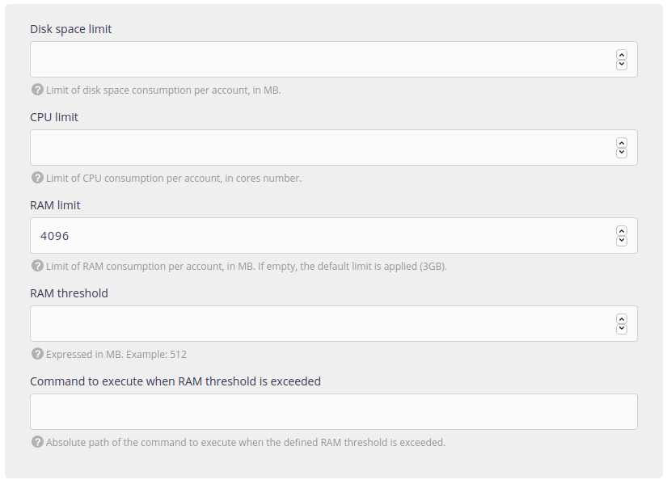

> [!NOTE]
> Feature only available on [Private Cloud](/en/docs/admin-billing/billing/private-cloud-prices) environments.

The **Resources** menu allows to configure sysadmin resources, as the disk space, CPU or memory:

- *Disk space limit*: maximum limit that an account can reach at a given time. If it is reached, downtime can be expected.

- *CPU limit*: maximum limit that an account can reach at a given time. If it is reached, slowdowns or downtime can be expected.

- *RAM limit*: maximum limit that an account can reach at a given time. If it is reached a process (not necessarily the most consuming) is automatically killed by the system.

It is possible to manage these three limits on *server* or *account* levels. The account level values **take the lead** over the server values.

- *RAM treshold*: treshold at which the script described below is performed.

- *Command to execute when RAM threshold is exceeded*: command/script executed by the system when the threshold is reached. This allows not to kill a process "at random".
