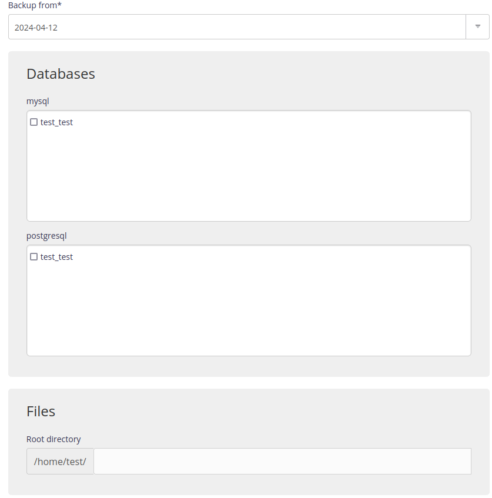

Backups of your files and databases are located in the `/home/[account]/admin/backup` directory for your account. You can restore them using the **Advanced > Restore backups** menu.

1.  Choose the required date,
    

2.  Then check the one or more databases and/or directories required [^1].
    

> [!WARNING]
> Restore will overwrite the current configuration, so make a backup first.


> [!NOTE]
> The restore time depends on the size of the files to restore.


## SSH mode

To restore a backup manually.

- Connect to your account [in SSH](/en/docs/web-hosting/remote-access/ssh) ;

- Restore files:

    ```sh
    $ rsync -av --delete /home/[account]/admin/backup/[date]/files/[directory]/ /home/[account]/[directory]/
    ```

> [!WARNING]
> `--delete` will delete all of the files from this directory that have been created since the backup date. 
> To run a test add `-n`.


- Restore a MySQL database:

    ```sh
    $ zstdcat /home/[account]/admin/backup/[date]/mysql/[base].sql.zst | mysql -h mysql-[account].alwaysdata.net -u [user] -p [base]
    ```

- Restore a PostgreSQL database:

    ```sh
    $ zstdcat /home/[account]/admin/backup/[date]/postgresql/[base].sql.zst | psql -h postgresql-[account].alwaysdata.net -U [user] -W -d [base]
    ```

> [!TIP]
> The archived contents (e.g. BDD dumps) in your *backup* space are in [Zstandard](https://github.com/facebook/zstd) format, you can use the [official `zstd*` tools](https://github.com/facebook/zstd/releases/latest) or the [adapted plugin for 7zip](https://www.tc4shell.com/en/7zip/modern7z/) to manipulate them.


[^1]: It is not mandatory to restore both databases and files.
