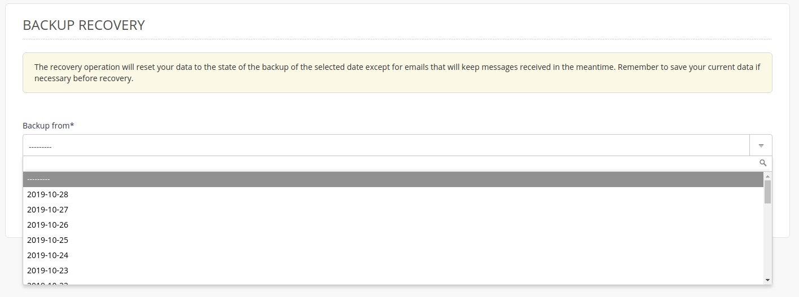
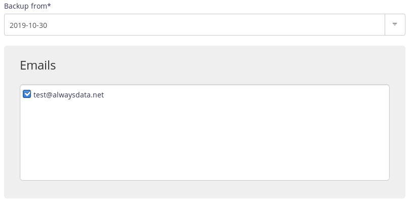

Backups of your e-mails are located in the `$HOME/admin/backup` directory for your account. You can restore them using the **Advanced > Restore backups** menu.

> [!INFO]
> The e-mails present on the backup date will be restored. No e-mail sent or received since will be deleted.


1.  Choose the required date,
    

2.  Then check the one or more e-mail boxes.
    

> [!NOTE]
> The restore time depends on the size of the files to restore.


## SSH mode

To restore a backup manually.

- Connect to your account [in SSH](/en/docs/web-hosting/remote-access/ssh) ;

- Restore e-mails:

    ```sh
    $ rsync -av $HOME/admin/backup/[date]/mails/[domain]/[mailbox]/ $HOME/admin/mail/[domain]/[mailbox]/
    ```
