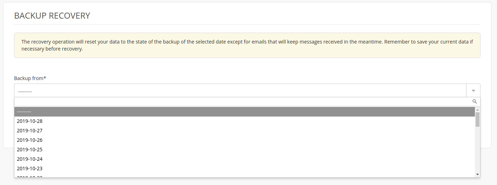
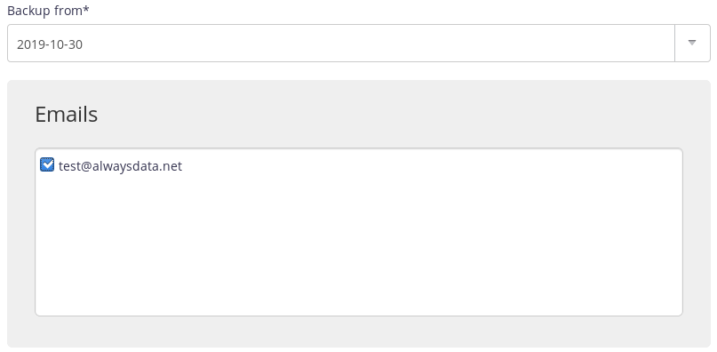

Backups of your emails are located in the `/home/[account]/admin/backup` directory for your account. You can restore them using the **Advanced > Restore backups** menu.

> [!NOTE]
> The emails present on the backup date will be restored. No email sent or received since will be deleted.


1.  Choose the required date,
    

2.  Then check the one or more mailboxes.
    

> [!NOTE]
> The restore time depends on the size of the files to restore.


## SSH mode

To restore a backup manually.

- Connect to your account [in SSH](/en/docs/web-hosting/remote-access/ssh) ;

- Restore emails:

    ```sh
    $ rsync -av /home/[account]/admin/backup/[date]/mails/[domain]/[mailbox]/ /home/[account]/admin/mail/[domain]/[mailbox]/
    ```
