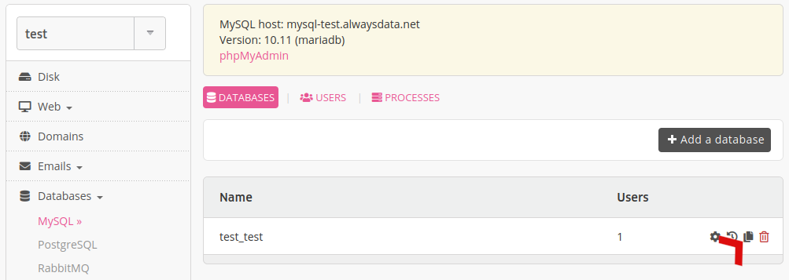
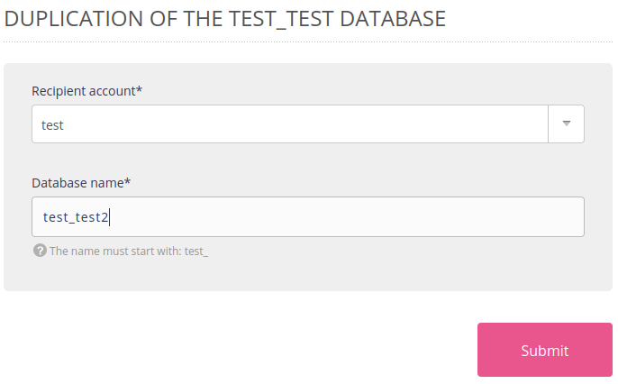
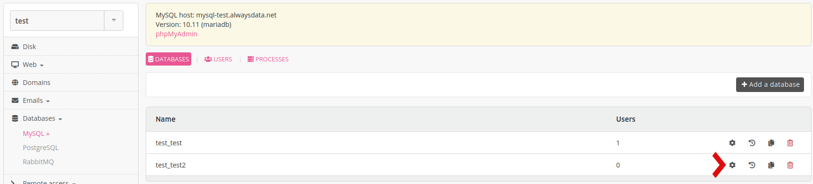
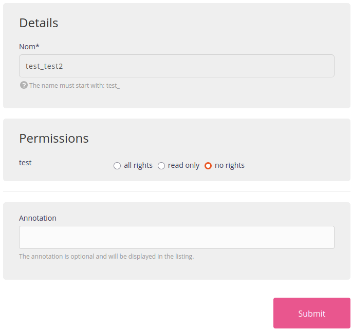

It is possible to duplicate a database via **Databases > [DBMS] > Duplicate the [database] - 📄**.

Choose the recipient account and the name of the new database.

When creating this new database, no user on the account has any rights to it. You will need to choose permissions for each user on the account via **Databases > [DBMS] > Modify [the database] - ⚙️**.

