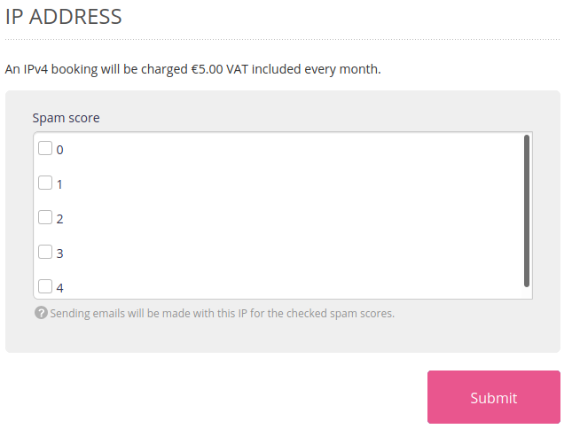

Regardless of your offer[^1], extras IPv4 addresses are available in **Advanced > IP Addresses** menu. These IPs are bound to your account and are charged 5€ VAT inc./mo or 60€ VAT inc./y[^2].

## HTTP

Once the extra IP subscribed :

- If the domain is managed on our DNS servers, you will be able to bind it to an address via **Advanced > IP  Addresses**,
- If the domain is managed on external DNS servers, create at your DNS provider an **A DNS record** pointing to the extra IP.

> [!NOTE]
> Extras IPs are used for incoming requests only. Outgoing requests always go through the main IP of the HTTP server on which the account is located. This IP is accessible in **Advanced > Servers status** menu.

## SMTP

The extra IP will be used to send emails.

Once subscribed, you will be able to indicate which emails should go through the extra IP, according to the [score set by the antispam](/en/docs/e-mails/outgoing-e-mails/delivery#scoring-system):

> [!NOTE]
> The lower the score, the better the e-mail will be rated.

[^1]: Available for all plans, extras IP differ from [Private Cloud offers](/en/docs/admin-billing/billing/choose-its-paas).
[^2]: For a annual subscription, contact the [support team](https://admin.alwaysdata.com/support/add).
