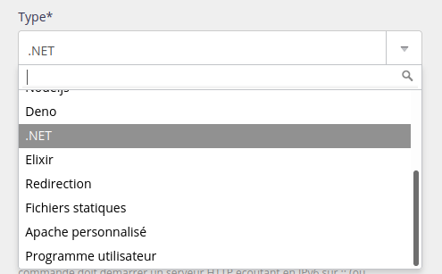

## Supported Versions

||
|-----|
| 10.0 |
| 8.0 |
| 6.0 |
| 5.0 |

The default version can be changed from the administration section, under **Environment > .NET**. This is the version that is especially used when you start `dotnet`.

Versions are not necessarily [already installed](/en/docs/web-hosting/languages#versions).

> [!NOTE]
> Major releases of .NET alternate between Long Term Support (LTS) and Standard Term Support (STS) following their [releases lifecycle](https://dotnet.microsoft.com/en-us/platform/support/policy/dotnet-core#lifecycle). Only **LTS versions** are made available and they are released once the General Availability (GA) version is fully supported by Microsoft.


## Environment

Your .NET environment starts off empty, with no ready installed libraries.

## HTTP deployment

To deploy an HTTP application with .NET, create a *.NET* type site in the **Web > Sites** section. 



You need to specify the command that will start your Deno application, for example:

```
dotnet run --urls "http://$IP:$PORT"
```

> [!WARNING]
> Your application must absolutely listen to IP and the port shown in the site configuration in the *Command* field. The `IP` / `HOST` and `PORT` environment variables can also be used.
