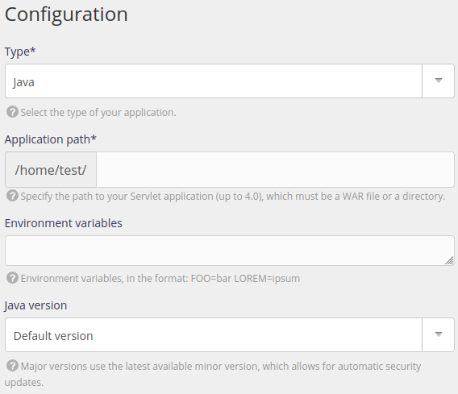
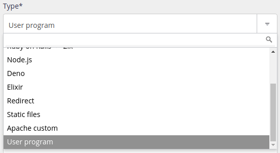

## Supported versions

||
| -- |
| 25 |
| 21 |
| 17 |
| 11 |
| 8  |

The default version can be changed from the alwaysdata administration, under **Environment > Java**. This is the version that is especially used when you start `java`.

Versions are not necessarily [already installed](/en/docs/web-hosting/languages/#versions).

> [!NOTE]
> Only **[LTS versions](https://www.java.com/releases/)** are made available.


## Binary to use

To use a Java version that is different from the default one:

- go on **Environment > Java**,
- or use `JAVA_VERSION=[VERSION] java` (replacing `[VERSION]` with the desired Java version).

## Environment

Your Java environment starts off empty, with no ready installed libraries.

## HTTP deployment

To deploy an HTTP application with Java, create a site in the **Web > Sites** section. You can choose between two types:

### Java

It uses the [Apache Tomcat](https://tomcat.apache.org/) HTTP server.



- type: choose *Java*,
- application path: the path to the file of your Java application.

You can also fill-in a number of optional fields:

- environment variables to define,
- a specific version of Java to use.

### User Program

[Presentation](/en/docs/web-hosting/sites/http-servers/user-program)



You need to specify the command that will start your Java application, for example[^1]:

- [Jenkins](https://www.jenkins.io/doc/book/installing/initial-settings/)

```
$ java -Xmx512m -jar jenkins.war --httpListenAddress=$IP --httpPort=$PORT
```
- [Spring](https://docs.spring.io/spring-boot/docs/current/reference/html/application-properties.html#appendix.application-properties.server)

```
$ java -jar app.jar --server.address=:: --server.port=$PORT
```

> [!WARNING]
> Your application must absolutely listen to IP `::` and the port shown in the site configuration in the *Command* field or use the IP and PORT environment variables.


[^1]: The options depend on the application: it’s **essential** that you refer to the app's documentation to find out which options to use if you need to specify the IP address and the port in the command. This may also be the configuration file options.
