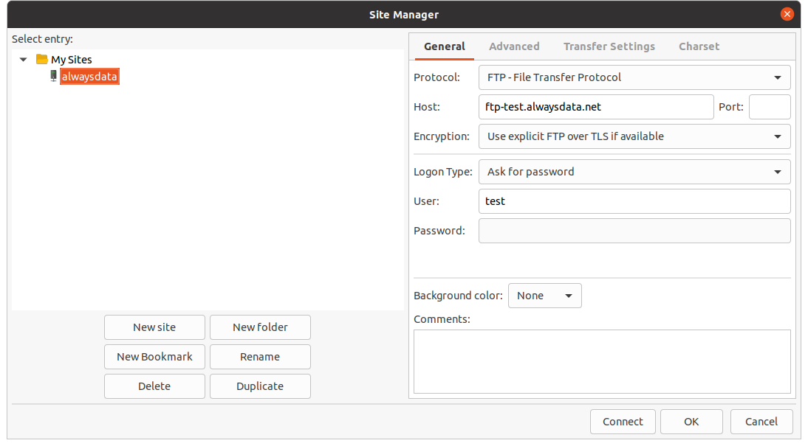
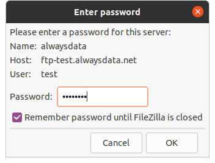
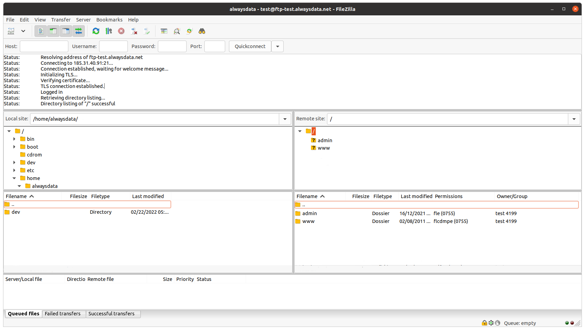

[Connection information reminder](/en/docs/web-hosting/remote-access/ftp#connecting-with-ftp)

[FileZilla](https://filezilla-project.org/) is a free FTP client that works on all operating systems.

In our example, we are using the account `test` and its primary FTP user. Replace it with your personal login information.

- Go to **Files > Site manager > New site**

- Enter your login information (hostname, username, and port) and then click on **Connect**
- Enter your password

- The connection is established, and now you can simply drag and drop files from the **Local Site** directory to the **Remote Site** directory.

Put the files directly into the `www` directory.
