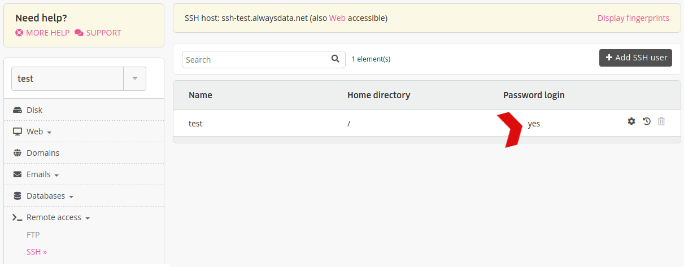
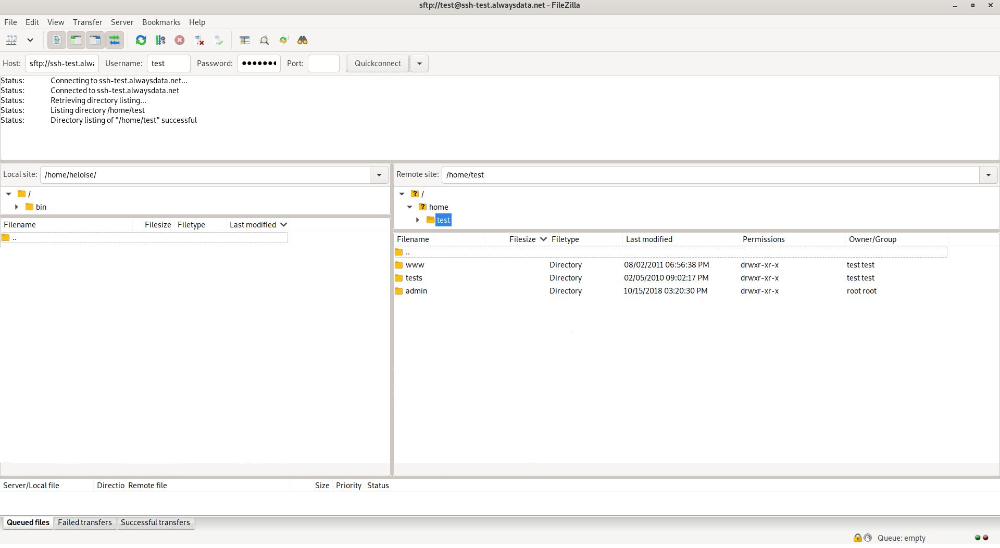

SFTP, the [SSH File Transfer Protocol](https://en.wikipedia.org/wiki/SSH_File_Transfer_Protocol), is used to secure an FTP transfer by passing through an SSH tunnel. Consequently, users can use a simple graphic interface via the FTP client of their choice.

## Connecting with SFTP

From **Remote access > SSH/SFTP** allow your SSH user *password connection* permission.

Then from your FTP client, fill-in the SSH connection information. Let us take the following example and the [FileZilla](https://filezilla-project.org/) FTP client:

  - user: `[account]`
  - password
  - hostname: `ssh-[account].alwaysdata.net`
  - port: `22`

## Miscellaneous

Users with the **SFTP only** shell are `chrooted`. This shell does not allow access to the directories `/home/[account]/admin/mail` and `/home/[account]/admin/backup`.

This must not be confused with the [FTPS](/en/docs/web-hosting/remote-access/ftp) protocol: FTP transfer secured by SSL or TLS protocols.
