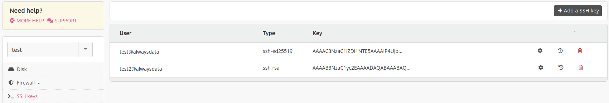

> [!NOTE]
> Feature only available on [Private Cloud](/en/docs/admin-billing/billing/private-cloud-prices) environments.

To easily manage your server accounts, you can install global SSH keys in the **SSH keys** tab for your server. These are used to connect to any account without knowing the password.

Your public SSH key to copy in this form is given in a file of the `$HOME/.ssh` directory of your computer (for example `$HOME/.ssh/id_ed25519.pub`). If you do not have one you can [generate it](/en/docs/web-hosting/remote-access/ssh/use-keys).
