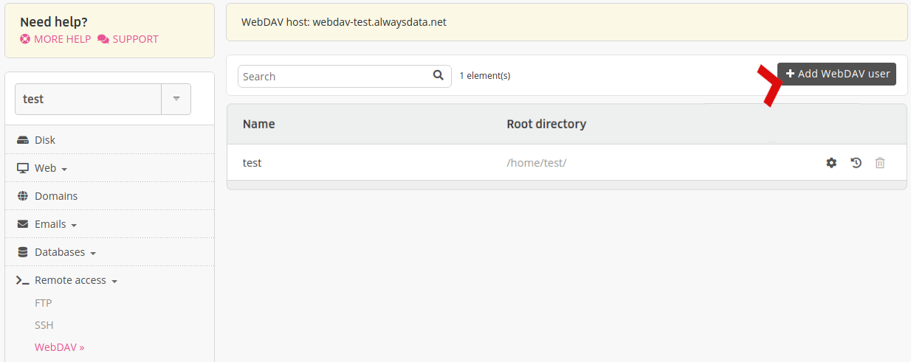
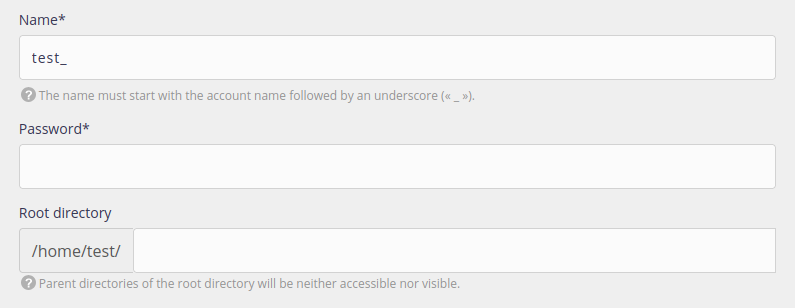

To connect to your account using *WebDAV*, you need to have a user. By default, a user with your `[account]` name was created with the account. You can create as many WebDAV users as you wish and you can administer them from your administration interface, from the **Remote access > WebDAV** tab.

- Name: WebDAV user name prefixed with your account name  (`[account]`),
- Password: the password assigned to the user,
- Root directory: the directory where the user finds their connection.

> [!NOTE]
> WebDAV proposes isolation: the user cannot move around freely in their root directory's parent directories.
