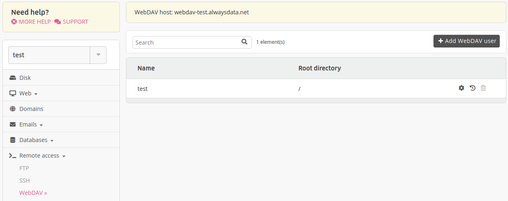

WebDAV stands for [Web-based Distributed Authoring and Versioning](http://www.webdav.org/) and it allows users to collaboratively modify and manage files on remote web servers.

- [WebDAV - API](https://api.alwaysdata.com/v1/webdav/doc/)
- [Create a WebDAV user](/en/docs/web-hosting/remote-access/webdav/create-a-webdav-user)

## Connecting with WebDAV

|Information||
|--- |--- |
|Host|webdav-[account].alwaysdata.net|
|Ports|80 (HTTP) or 443 (HTTPS)|
|Identifier|assigned **user** (**[account]**) and **password**|

These users can be configured in the **Remote access > WebDAV** tab in your alwaysdata administration interface.



### With Windows

1.  Right click on the **Workstation** or **Computer** icon,

2.  Choose **Connect a network drive**. From the *Folder* field, specify:
    - in Vista and higher: `https://webdav-[account].alwaysdata.net/`

3.  Click on *Connect* under a different user name, then enter your identifiers. Validate and click on *Finish*.

### With macOS

1.  From the **Finder**, choose *Go > Connect to server*,

2.  From the *Server address* field, enter `https://webdav-[account].alwaysdata.net/` ;

3.  Click on *Connect*.

### With rclone (Linux / macOS)

[**rclone**](https://rclone.org/) is a powerful tool for synchronizing and managing files on cloud storage services and network shares, including WebDAV.

#### Installation

Download and install rclone:

```sh
$ curl https://rclone.org/install.sh | sudo bash
```

Or use your package manager:

```sh
# Debian/Ubuntu
$ sudo apt install rclone

# Fedora/RHEL
$ sudo dnf install rclone

# macOS
$ brew install rclone
```

#### Configuration

Create an interactive rclone configuration:

```sh
$ rclone config
```

Select the option to create a new remote and choose the **webdav** type. Then:

1. Name your remote (e.g., `alwaysdata`);
2. Enter your WebDAV server URL: `https://webdav-[account].alwaysdata.net/`;
3. Enter your WebDAV identifier (format: `[account](…)`);
4. Enter your WebDAV password;
5. Confirm the settings and save the configuration.

#### Usage

Once configured, you can:

**List files:**
```sh
$ rclone ls alwaysdata:
```

**Mount as a file system:**
```sh
$ mkdir -p ~/alwaysdata
$ rclone mount [--daemon] --vfs-cache-mode writes alwaysdata: ~/alwaysdata
```
The `--daemon` option runs the process as a daemon and returns the shell.
If you encounter the error `Fatal error: failed to mount FUSE fs: fusermount: exec: "fusermount": executable file not found in $PATH`, install the `fuse3` package.

**Synchronize files:**
```sh
# Download from alwaysdata
$ rclone sync alwaysdata:/ ~/Documents/backup/

# Upload to alwaysdata
$ rclone sync ~/Documents/ alwaysdata:/
```

> [!NOTE]
> Replace `webdav-[account].alwaysdata.net` with your WebDAV hostname available from **Remote access > WebDAV**.
