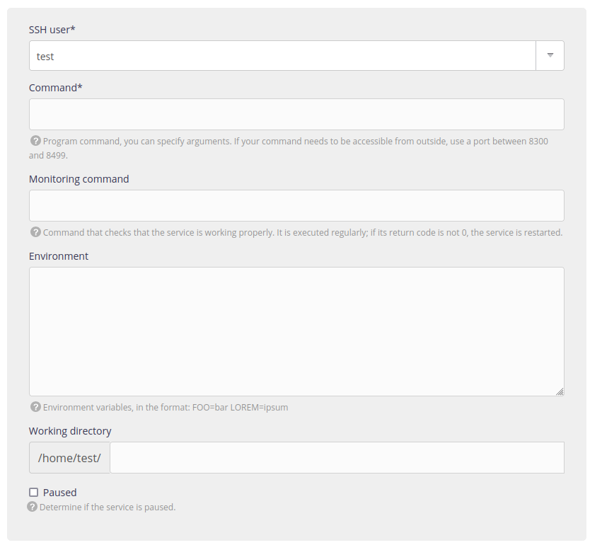

You can register services: custom programs running in a headless mode (i.e. without any user interaction). Unlike a command launched by-hand trough SSH, those services will be restarted automatically by the system when the service stops.

Those services are declared in the [administration panel](https://admin.alwaysdata.com)'s  **Advanced > Services**.



The ports' range `8300` to `8499`, as well as the hostname `services-[account].alwaysdata.net`[^1] are reserved to those services.

- [API reference](https://api.alwaysdata.com/v1/service/doc/)

## Use services

- It must runs in `foreground`, not fork and leave [^2].
- When needing to be reached from an external application, bind it to `::` (_IPv6_) and a port from `8300` to `8499`.
- Log files for running services are located at `/home/[account]/admin/logs/services/`, containing services' outputs.
	- An extract of those logs is presented in the administration’s interface (**Logs** - 📄).
- Current processes are accessible via the **Advanced > Processes > Services** menu.
- The restart of a service sends the `SIGHUP` signal.
- If a service fails repeatedly within a short period of time, it will be automatically disabled.
- The language versions used by default are those specified in the **Environment** menu of the administration interface. It is possible to choose another version using the *Environment variables*.

The optional *Monitoring command* allows you to specify a command used to check the service's status. When this command returns an error code, the service is restarted. E.g. you can ping the service on the assigned port (i.e. *8300*):

```sh
$ nc -z services-[account].alwaysdata.net 8300
```
	
> [!WARNING]
> There is no network filtering, anyone can connect to your services. Make sure your services have an authentication mechanism if necessary.


For [Public Cloud](/en/docs/admin-billing/billing/public-cloud-prices) users:

- Services are executed on a distinct servers than SSH and HTTP servers.
- Their resources use must remain fair.
- The services will not be available on IPv4, only on IPv6.

For [Private Cloud](/en/docs/admin-billing/billing/private-cloud-prices) users:

- Range port `8300` to `8499` are *not* accessible from the external network. You can expose them to Internet using a [firewall rule](/en/docs/technical-specifications/configure-firewall).
- You can use other ports ; for example the default port of the application.

## Troubleshooting
 
- They use the default language versions of the accounts (defined in **Environment**). To use others, specify them in the *Environment variables* field.

## Examples

- [Mattermost](/en/docs/development/guides/mattermost#service-launch)
- [Memcached](/en/docs/development/guides/memcached#step-2-service-launch)
- [MongoDB](/en/docs/development/guides/mongodb#service-launch)
- [Redis](/en/docs/development/guides/redis#service-launch)

[^1]: `[account]` to be replace by the account name.
[^2]: See [simple `systemd` service](https://www.freedesktop.org/software/systemd/man/systemd.service.html#Type=) for use-cases.
