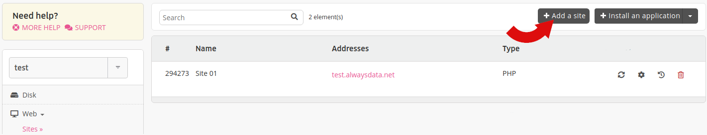
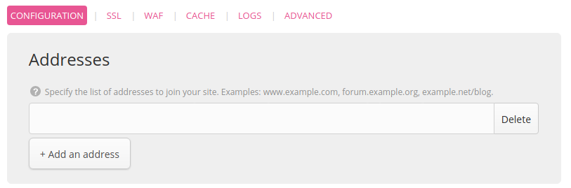
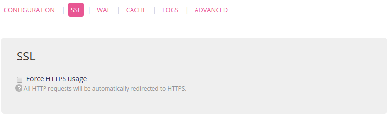
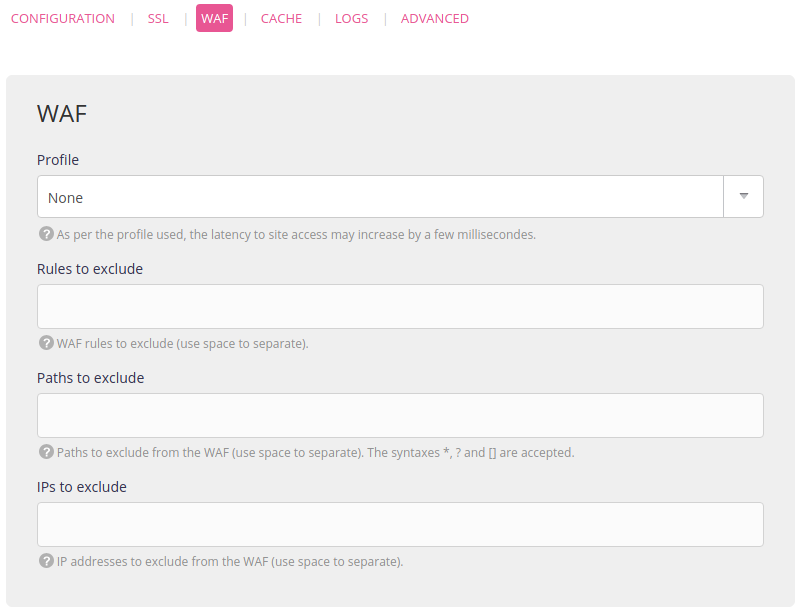
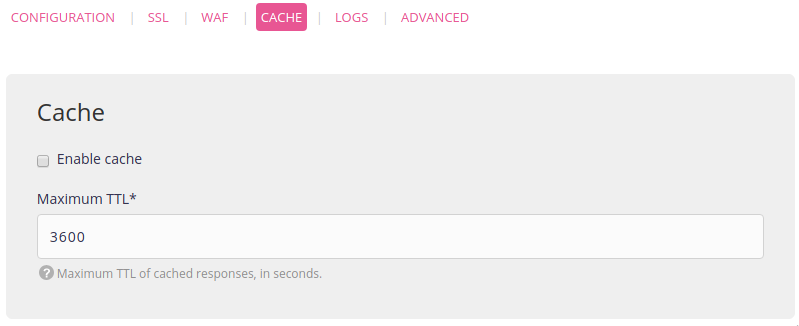
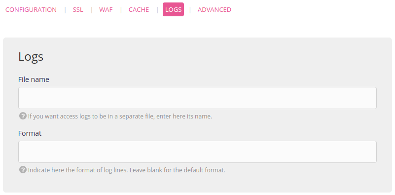
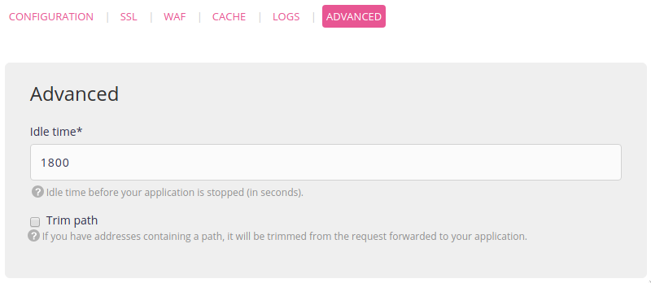

Go to the **Web > Sites > Add a site** menu.

> [!TIP]
> If you are starting from scratch you can take advantage of our [application library](/en/docs/development/marketplace) by going to **Web > Sites > Install an application**.

## Addresses
Adding all the addresses in this menu is **mandatory** to access them as sites:
- for example, to access a website on *www\.example.org* and *example.org* both addresses must be added,
- entering your domain in the **Domains** menu is not enough either. Even for a domain using our [DNS servers](/domains#dns-management).

Also, if the domain does not use our DNS servers, you will need to [create DNS records](/en/docs/web-hosting/sites/use-external-addresses) with the DNS provider.

> [!NOTE]
> Adding the site will not create the *root directory*, it has to be created by [remote access](/en/docs/web-hosting/remote-access).

To create a catch-all, indicate `*.example.org`.

## Configuration
Specific to every type of site:

- [PHP](/en/docs/web-hosting/languages/php),
- [Python WSGI](/en/docs/web-hosting/languages/python),
- [Ruby Rack](/en/docs/web-hosting/languages/ruby),
- Ruby on Rails <= 2.x,
- [Node.js](/en/docs/web-hosting/languages/nodejs),
- [Elixir](/en/docs/web-hosting/languages/elixir),
- [Deno](/en/docs/web-hosting/languages/deno),
- [.NET](/en/docs/web-hosting/languages/dotnet),
- [Java](/en/docs/web-hosting/languages/java),
- [Redirect](/en/docs/web-hosting/sites/redirect),
- Reverse proxy: sets up a reverse proxy to a URL,
- [Static files](/en/docs/web-hosting/sites/static-files): to manage sites or static files,
- [Custom Apache](/en/docs/web-hosting/sites/apache-custom): to fully configure your Apache server,
- [User program](/en/docs/web-hosting/sites/user-program): to run any web server.

PHP, Static Files and Custom Apache websites are served by [Apache](https://httpd.apache.org/). Python WSGI, Ruby Rack and Ruby on Rails <= 2.x use [uWSGI](https://uwsgi-docs.readthedocs.io/en/latest/).

## SSL

See [SSL](/en/docs/web-hosting/sites/ssl-tls/redirect-http-to-https).

## WAF

See [WAF](/en/docs/web-hosting/sites/waf).

## Cache

See [Cache](/en/docs/web-hosting/sites/http-cache).

## Logs

See [Logs](/en/docs/web-hosting/sites/formatting-http-logs).

## Advanced

> [Idle time](/en/docs/web-hosting/sites/misc#idle-time)

---

HTTP logs are available from directory `$HOME/admin/logs/http/`. The *site* logs showing "upstream" web site starts, stops and malfunctions are available from `$HOME/admin/logs/sites/`. An extract of these logs (with Apache & uWSGI logs) is presented in the administration’s interface (**Logs** - 📄).
