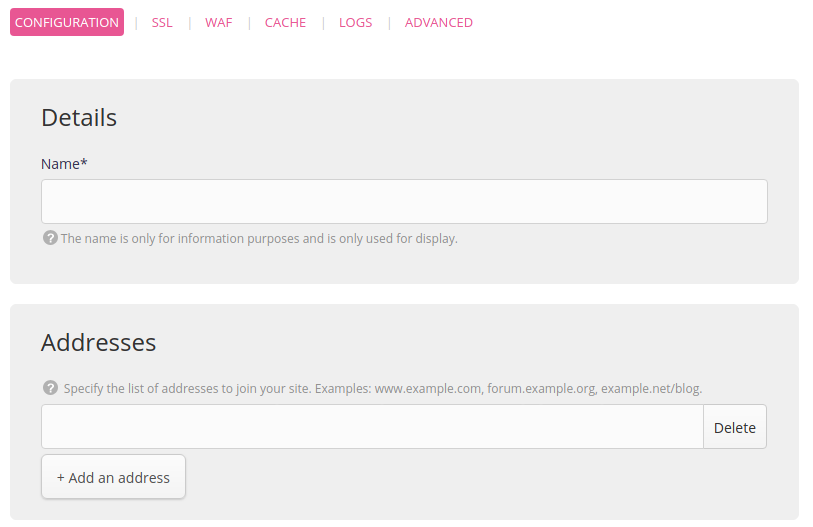
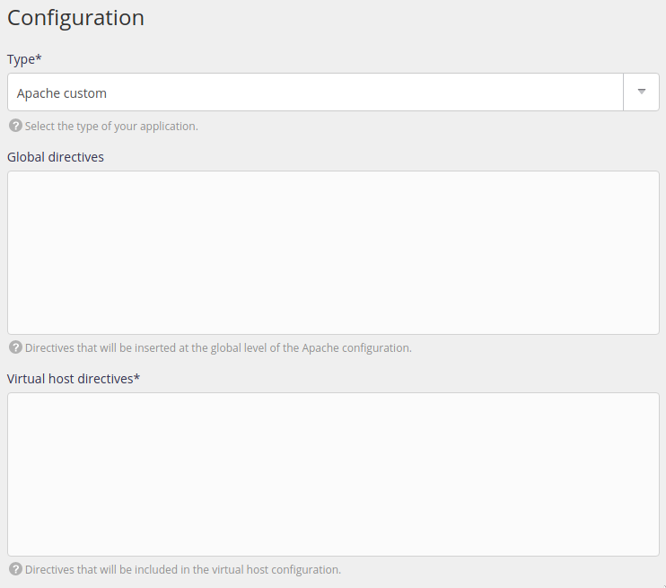

The custom Apache type is used to run sites served by the Apache server that do not use PHP or HTML.

> [!WARNING]
> If you only wish to add global directives to Apache, change its [configuration](/en/docs/web-hosting/sites/configure-apache) in **Web > Configuration > Apache**.

Go to the **Web > Sites > Add a site** menu.

- Name: used for display purposes in the alwaysdata administration interface, it is purely for information purposes,
- Addresses: the addresses used to reach your site (`*.example.org` for _catch-all_),

- Type: Custom Apache,
- Global directives: directives that apply to all of the sites served by Apache,
- Virtual host directives: Apache directives for the relevant site.

All of the modifications will impact the `/home/[account]/admin/config/apache/sites.conf` file. Apache error logs are available in file `/home/[account]/admin/logs/apache/apache.log`.
