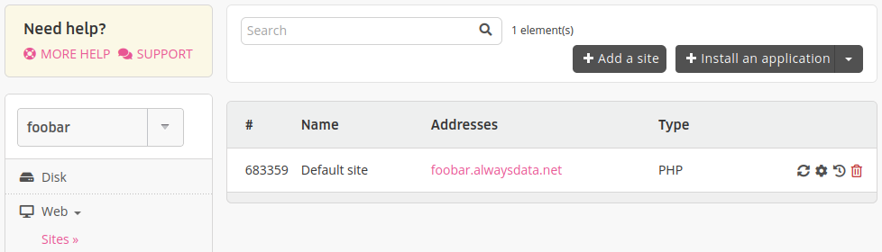
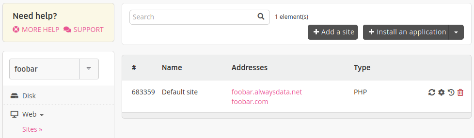
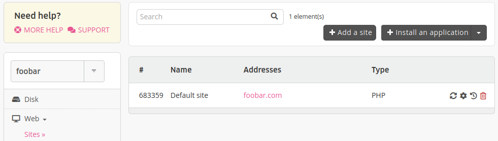

Your site points to an address and you want to use another address/domain. Here are the steps to follow:

In this example, the starting address will be `foobar.alwaysdata.net` and the new address `foobar.com`. 

> [!NOTE]
> `.alwaysdata.net` addresses won't be a possible choice.

1. Point your domain addresses on our servers:

    - if the domain does not exist, you need to [buy it](/en/docs/domains/buy-a-domain),
    - if the domain exists, you can:
        - add only the [addresses needed](/en/docs/web-hosting/sites/use-external-addresses) for the website,
        - pass all the [technical management](/en/docs/domains/add-an-external-domain) to our DNS servers,
        - [transfer](/en/docs/domains/transfer-a-domain) the domain,
        
2. Add the new addresses to the site in **Web > Sites** - the old one is still there,

3. Change the address at the application level (in its admin panel for example),

4. Remove the old address in **Web > Sites**. This last point is *not mandatory*, if you don't do it the site will just remain accessible on the old address - as long as it points on our servers.

