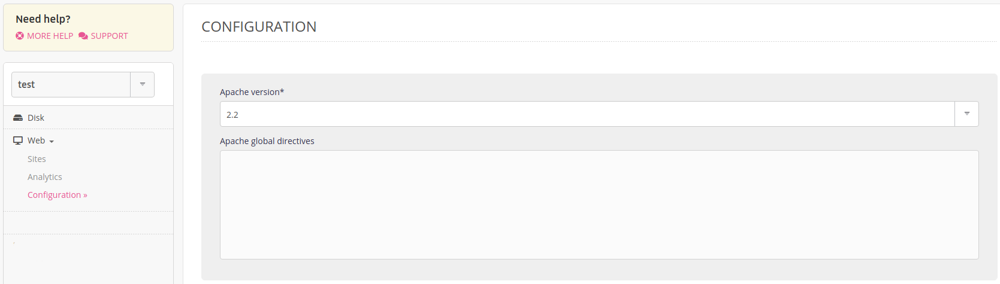

[Apache](http://httpd.apache.org/)2.4 is available on our servers. To add global directives to your Apache configuration go to **Web > Configuration > Apache**.



All of the modifications made in the *Apache global directives* field will impact the `/home/[account]/admin/config/apache/sites.conf` file. Apache error logs are available in file `/home/[account]/admin/logs/apache/apache.log`. An extract of these logs is presented in the administration’s interface (Logs - 📄).

Apache serves PHP, Static Files and Custom Apache websites.

- [Apache 2.4 documentation](http://httpd.apache.org/docs/2.4/en/)
- [File .htaccess](/en/docs/web-hosting/sites/htaccess-file)

## Installing a module

Once the `.so` file is compiled and added to your [file space](/en/docs/web-hosting/remote-access), insert this line into the global directives:

```
LoadModule <MODULE> /home/[account]/path/to/module.so
```

- [GeoIP](/en/docs/development/guides/geoip)
