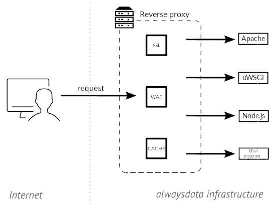

A front-end reverse-proxy is installed on all our servers. This one listens incoming HTTP requests and:

- launches the [defined](/en/docs/web-hosting/sites/add-a-site) HTTP servers and programs to serve your data,
- returns the right [SSL certificate](/en/docs/web-hosting/sites/ssl-tls/certificates-priorities),
- logs HTTP requests. These logs are available via the [`/home/[account]/admin/logs` directory](/en/docs/web-hosting/remote-access/admin-directory#logs).

It also manages the [Web Application Firewall](/en/docs/web-hosting/sites/waf) and the [HTTP cache](/en/docs/web-hosting/sites/http-cache) which can be activated in **Web > Sites**.

 We add to *headers*:
 
- `X-Forwarded-Proto`, which equals http or https depending on whether the connection is made in HTTP or HTTPS. Thus the reverse proxy accesses web servers in HTTP whether the connection at the browser level is HTTP or HTTPS,
- `X-Real-IP`,  which takes the value of the user's IP address.

---
Icons: The Noun Project
