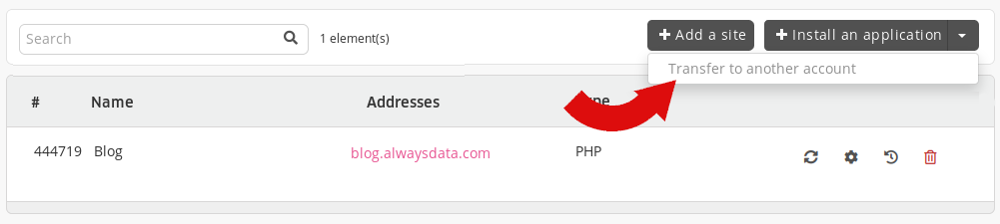
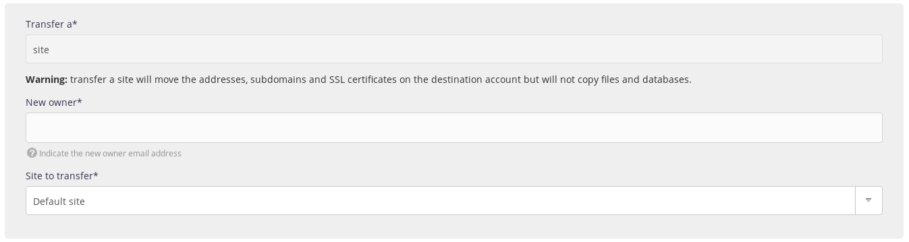

This article explains how to move a site to another alwaysdata account.

To do this we will use the [SSH access](/en/docs/web-hosting/remote-access/ssh) rather than FTP which requires bringing the files back locally and then transferring them to the destination account.

In our example, we will consider the following information:

- Original account name: `foo`
- Destination account name: `bar`
- Original database name: `foo_base`
- Destination database name: `bar_base`
- The site is located in directory `$HOME/www/`
- We will use the default SSH users and databases, i.e. the ones created when the accounts are opened (e.g. `foo` for the *foo* account and `bar` for the *bar* account).

## 1. Copying files

We will use the [scp](https://linux.die.net/man/1/scp) command after connecting in SSH mode to the **destination** account.

```sh
bar@ssh:~$ scp -r foo@ssh-foo.alwaysdata.net:/home/foo/www/* ~/www/
```

## 2. Importing the database

This step is only necessary if your site is connected to a database.

If both accounts use the same version of DBMS and belong to the same profile, you can use our [database duplication](/en/docs/web-hosting/databases/duplicate-database) functionality.

Otherwise, you can do it manually by creating the database on the _destination_ account and then running the following commands:

-   MySQL:
    ```sh
    bar@ssh:~$ mysqldump -u foo -p -h mysql-foo.alwaysdata.net foo_base > foo_base.sql
    bar@ssh:~$ mysql -h mysql-bar.alwaysdata.net -u bar -p bar_base < foo_base.sql
    bar@ssh:~$ rm foo_base.sql
    ```

-   PostgreSQL:
    ```sh
    bar@ssh:~$ pg_dump -U foo -W -h postgresql-foo.alwaysdata.net foo_base > foo_base.sql
    bar@ssh:~$ psql -h postgresql-bar.alwaysdata.net -U bar -W -d bar_base < foo_base.sql
    bar@ssh:~$ rm foo_base.sql
    ```

> [!NOTE]
> In both cases, you will need to modify the configuration file of the previously copied site to point to the newly imported database.


## 3. Moving addresses

> [!NOTE]
> Only the *account owner* can initiate a transfer.


Now what remains is to move the addresses that link the site and the automatically generated SSL certificate.

1.  Go to the **Web > Sites** section in the original account,

2.  Choose the **Transfer to another account** action,
    

3.  And follow the steps.
    
    
WARNING: For websites using a command[^1], the transferred website MAY have its port changed.

> [!NOTE]
> A `.alwaysdata.net` address can not be transferred as it is linked to the account name.


> [!TIP]
> To move it to another of *their* accounts, simply provide their own e-mail address.


[^1]: Node.js, User program, Elixir and Deno types.
