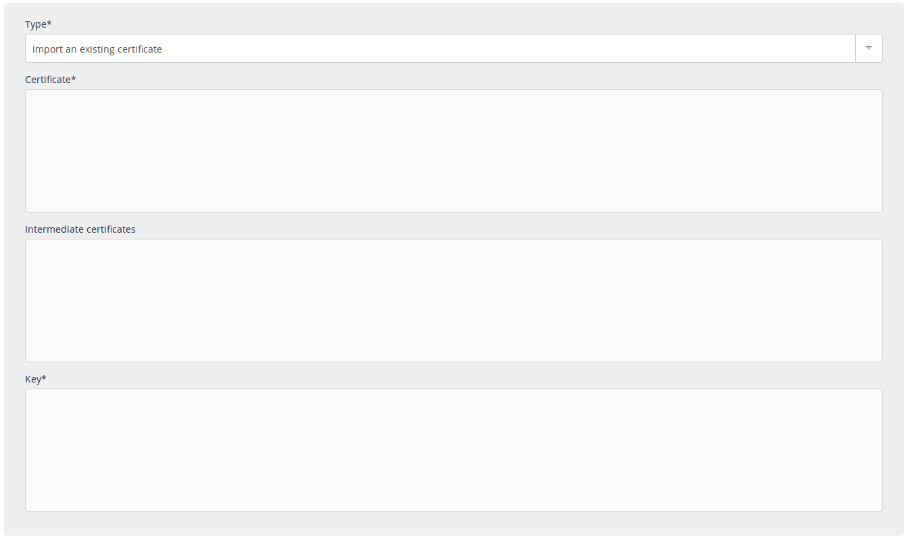

Add your certificate to the **Advanced > SSL certificates > Add an SSL certificate** in your alwaysdata interface.

Private key, certificate and intermediate certificates must be in PEM format.

You can add certificates for a specific address, [SAN](https://en.wikipedia.org/wiki/Subject_Alternative_Name) (multi-domain) certificates or [wildcard](https://en.wikipedia.org/wiki/Wildcard_certificate) certificates.

If you do not have an SSL certificate, you can use our [Let's Encrypt certificates](/en/docs/web-hosting/sites/ssl-tls/lets-encrypt) or buy them from an SSL certificate vendor after providing them with the [previously created CSR](/en/docs/web-hosting/sites/ssl-tls/csr).
