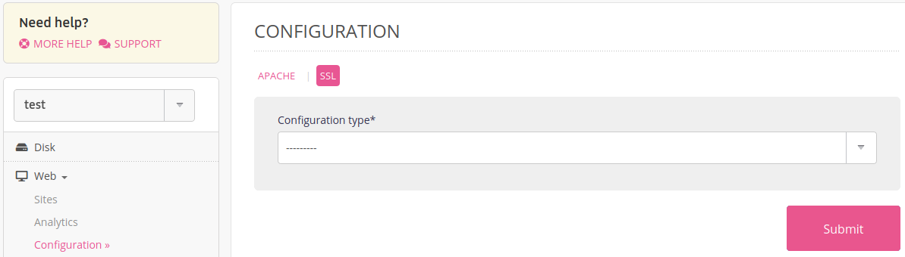
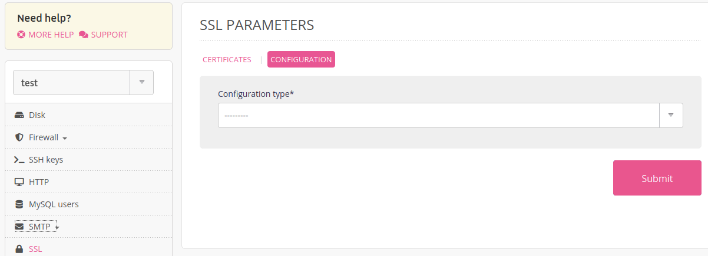

[TLS](https://en.wikipedia.org/wiki/Transport_Layer_Security) is a cryptographic protocol to secure Internet communications.

Three presets for HTTP connections are available:

- _Modern_: only TLS 1.3. Compatible with latest browsers.
- _Intermediate_: TLS versions higher than 1.2 are activated. Compatible with most web browsers.
- _Old_: all TLS versions are activated. Compatible with olders web browsers.

> [!NOTE]
> The _Intermediate_ profile is activated by default on alwaysdata's servers.

To change the TLS profile at the account level you need to edit the profile in the **Web > Configuration > SSL** menu:

## Private Cloud

Owners of [Private Clouds](/en/docs/admin-billing/billing/private-cloud-prices) can set the HTTP TLS profile at the _server_ level in the **SSL > Configuration** menu:

