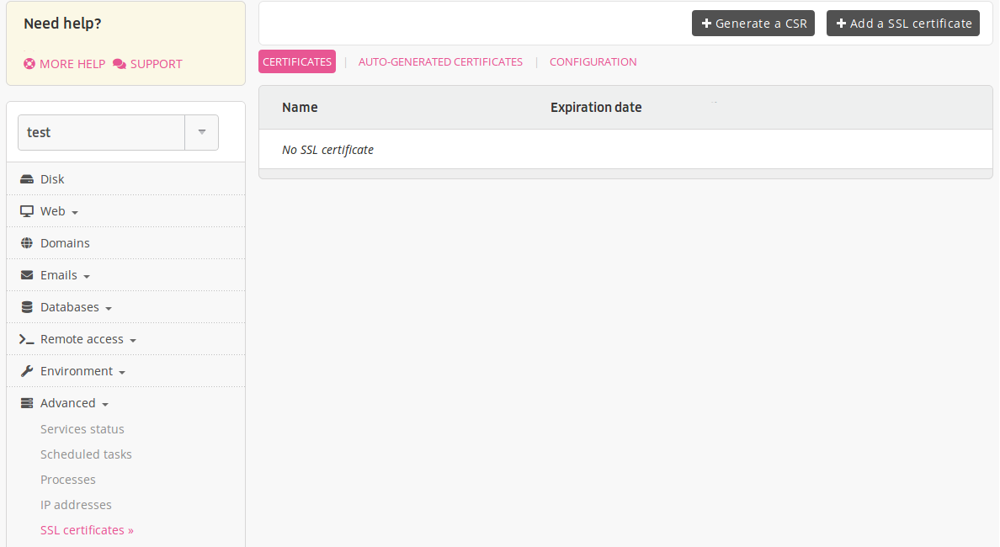
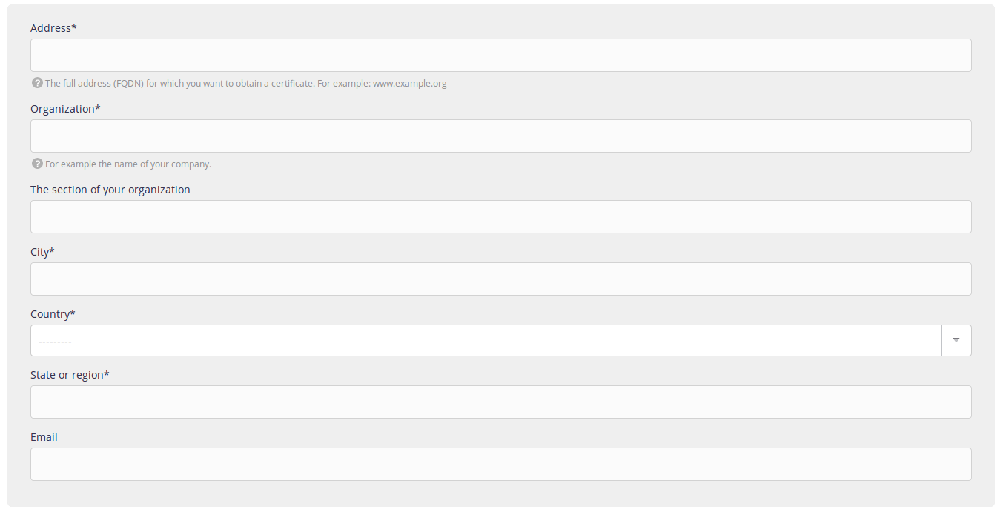

When purchasing a certificate, you will be asked for a CSR or [Certificate Signing Request](https://en.wikipedia.org/wiki/Certificate_signing_request).

To generate one, go to the **Advanced > SSL certificates > Generate a CSR**.

