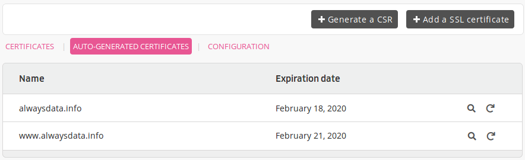

[Let's Encrypt](https://letsencrypt.org) is a certification authority that proposes a simple way to generate free certificates. The certificates offered are [Domain Validation](https://en.wikipedia.org/wiki/Domain-validated_certificate) type ones, valid for [90 days](https://letsencrypt.org/2015/11/09/why-90-days.html).

To avoid duplicates, alwaysdata enables the generation of Let's Encrypt certificates only for [wildcard certificates](/en/docs/web-hosting/sites/ssl-tls/lets-encrypt#certificates-wildcard).

*.alwaysdata.net* addresses are handled by the `*.alwaysdata.net` wildcard certificate returned by default by the servers.

## Automatically generated certificates

alwaysdata automatically generates and renews a Let's Encrypt certificate for every address pointing to our servers and it is added in the **Web > Sites** section. Hence, every site hosted on its servers handles HTTPS protocol.

You can view them in the **Advanced > SSL certificates > Automatically generated certificates** section:

> [!WARNING]
> Certificate generation is limited to 64 characters per complete address.

### Troubleshooting

#### Certificate not created

The creation of these certificates is **dependent on DNS propagation**: the address must point to alwaysdata servers (an HTTP check is performed). Once the address is added in **Web > Sites**, the system will attempt to generate its certificate *every 30 minutes for 24 hours*. This will then change to *once a day*.

> [!TIP]
> People who add the addresses before changing the DNS records can, after making the changes with their DNS provider, restart the autogeneration by deleting the addresses from the site in **Web > Sites** and putting them back a few seconds later. **`WARNING`** this action is to be done **only once**, too many attempts can block the process and the certificate generation for a week. [Contact support](https://admin.alwaysdata.com/support/add) if the first attempt is unsuccessful.

## Wildcard certificates

When a domain use our [DNS servers](/en/docs/technical-specifications/login-details), it is possible to generate a [Let's Encrypt wildcard certificate](https://en.wikipedia.org/wiki/Wildcard_certificate) - *.example.org structure - in **Advanced > SSL certificates > Add a SSL certificate > Create a Let's Encrypt  wildcard certificate**. This certificate will be automatically renewed by the system.

Wildcard certificates require a DNS check to be generated; if you need to generate a certificate for a subdomain (e.g. `*.foo.example.org`), contact alwaysdata support.

> [!NOTE]
> These wildcard certificates are not valid for "naked" domains - example.org.

---
## Links

- [List of browser compatibilities](https://letsencrypt.org/docs/certificate-compatibility/)
- [Certbot](https://certbot.eff.org/): ACME client to generate your own certificates
