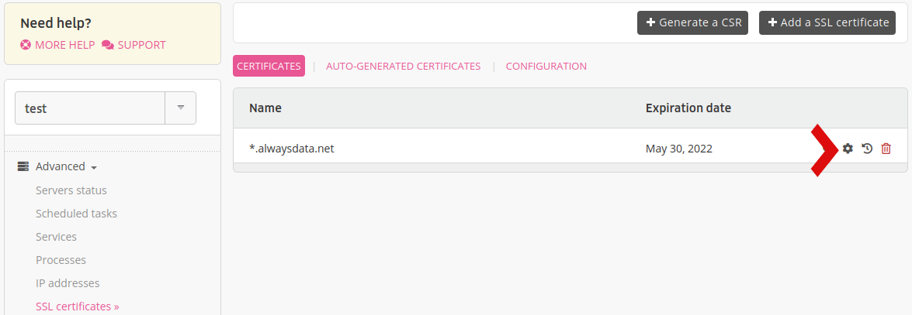
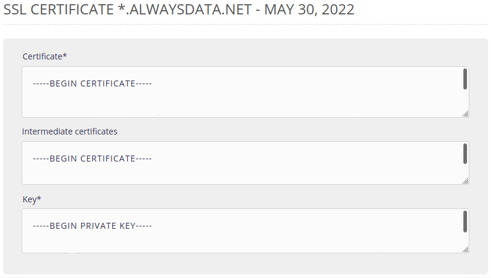

When you renew the SSL certificate with your supplier, they should provide you with a file containing the new certificate.

On your alwaysdata interface - **Advanced tab > SSL certificates** - modify the current certificate.

Change the **Certificate** field in order to include the content of the file provided by your SSL certificate supplier.

The certificate is now updated and its new expiration date will be displayed.
