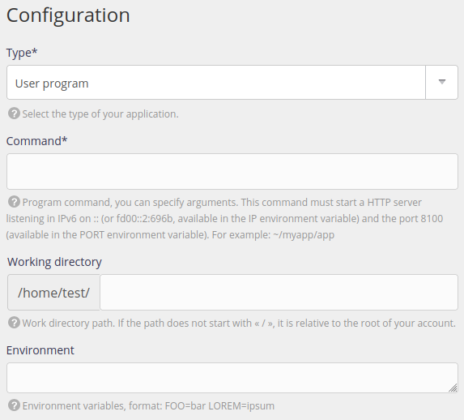

To run a web program that does not use one of the other types of site you can use the *User program*.

It may be used for [Erlang](https://www.erlang.org/), [Go](/en/docs/web-hosting/languages/go), [Java](/en/docs/web-hosting/languages/java), [Lua](/en/docs/web-hosting/languages/lua), [Rust](/en/docs/web-hosting/languages/rust), [Scala](https://www.scala-lang.org/),) and many other languages and software...[^1]

Go to the **Web > Sites > Add a site** menu.

- Name: used for display purposes in the alwaysdata administration interface, it is purely for information purposes,
- Addresses: the addresses used to reach your site (`*.example.org` for _catch-all_),

- Type: User program,
- Command: command to run to start the program. Your program's HTTP should point to the IP address and port provided in the explanatory text,
- Working directory,
- Environment: environment variables so that the program will work.

> [!TIP]
> Before setting up the site, you can test running the program in [SSH](/en/docs/web-hosting/remote-access/ssh).

If the program will not run, the *sites* logs available from the `$HOME/admin/logs/sites/` directory may help you.

[^1]: For example, [Nginx](https://www.nginx.com/), [LiteSpeed](https://www.litespeedtech.com/) or [Varnish](https://varnish-cache.org/) are all compatible with *alwaysdata* servers. Installation and configuration are your responsibility.
