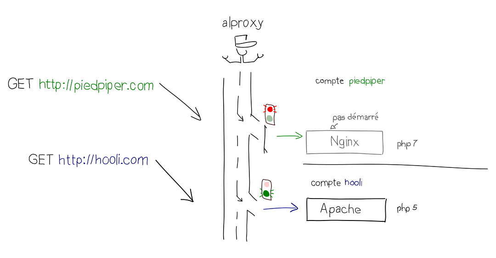
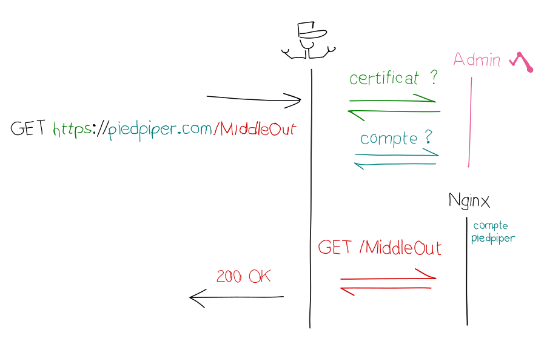

Aujourd'hui, nous annonçons le déploiement de la nouvelle version de notre reverse-proxy *alproxy* qui s'est terminé en début de semaine sur tous nos serveurs. Cette mise à jour marque une nouvelle étape vers la modernisation de nos services, et pour savoir ce qui change, suivez le guide !

## Reverse pro - quoi ?

Généralement, un seul programme a la tâche de gérer tout le trafic HTTP d'un serveur. Les services d'alwaysdata fonctionnent un peu différemment : chaque compte a son propre démon HTTP (Apache) qui sert ses pages web. Cette spécificité donne plus de contrôle à nos utilisateurs : par exemple, ils peuvent choisir la version de PHP qu'ils souhaitent utiliser, ou charger des modules Apache personnalisés.

Non seulement cette stratégie offre plus de flexibilité (comme la possibilité de s'interfacer avec son vieux serveur d'entreprise sous Windows, de quoi faire peur aux plus jeunes), mais elle nous permet aussi de mieux isoler les comptes qui se partagent un même serveur.

C'est pour gérer cette spécificité de notre architecture technique que nous avons eu besoin d'alproxy : alproxy reçoit une requête HTTP émise par un visiteur, regarde le site destinataire, et dirige cette requête au démon HTTP chargé de servir le site. alproxy est un peu le gardien qui distribue le courrier dans l'immeuble.

Mais alproxy ne fait pas que router les requêtes et réponses. Il a aussi et surtout pour responsabilité de veiller à la bonne santé du démon HTTP de chaque compte : il le démarre s'il est éteint, l'arrête quand il est inactif depuis longtemps (pour économiser la mémoire vive du serveur) et le relance quand sa configuration a changé ou qu'il a planté.

Enfin, alproxy s'occupe de la couche de chiffrement du trafic HTTPS, le tout dynamiquement : son comportement est piloté depuis l'interface d'administration d'alwaysdata, plutôt que décrit dans des fichiers de configuration.

## Les nouveautés d'alproxy

alproxy est un composant central de notre pile technique, cette nouvelle version apporte logiquement des améliorations sur de nombreux aspects.

### HTTPS mieux sécurisé que jamais et plus besoin d'une IP dédiée

Pour nos utilisateurs, cette mise à jour signifie des améliorations immédiatement disponibles, notamment du côté de HTTPS. Le trafic sécurisé est maintenant servi dans le respect des recommandations les plus modernes (note A sur SSLabs par défaut) : TLS 1.2, confidentialité accrue ([*forward secrecy*](https://fr.wikipedia.org/wiki/Confidentialit%C3%A9_persistante)). Encore plus pratique : grâce au [SNI](https://fr.wikipedia.org/wiki/Server_Name_Indication) il n'est plus nécessaire de louer une IP dédiée pour paramétrer son certificat SSL !

Nous travaillons activement à la génération automatisée de certificats gratuits [Let's Encrypt](https://letsencrypt.org/) : bientôt, vous pourrez activer HTTPS automatiquement pour tous vos sites (et tous vos domaines). Nous ajouterons bientôt le support d'OCSP et la gestion des sessions TLS, qui offrent quelques améliorations côté performances.

### Plus de robustesse, c'est toute une classe de problèmes potentiels qui disparait

La nouvelle architecture d'alproxy est plus robuste. Cela signifie que toute une classe de problèmes est automatiquement détectée et corrigée, mais aussi qu'alproxy réagit mieux en cas de surcharge (lors de DDoS par exemple).

### Utilisez Apache, Nginx, Node.js ou le serveur HTTP de votre choix... ou tout ça en même temps

Très prochainement, nous allons permettre à tous nos utilisateurs de configurer encore plus finement leurs services, et de choisir les démons HTTP qu'ils souhaiteront utiliser pour leurs sites. Cela signifie qu'il sera possible de remplacer Apache par Nginx, Node.js, ou même d'utiliser les trois en même temps sur un même compte !

Les plus téméraires pourront tester le serveur HTTP exotique de leur choix et laisser alproxy nettoyer en cas d'accident.

### Les WebSockets sont disponibles

Naturellement, il serait frustrant de pouvoir utiliser un serveur HTTP moderne sans profiter de fonctionnalités modernes, c'est pourquoi nous avons ajouté le support de [WebSocket](https://fr.wikipedia.org/wiki/WebSocket) dans alproxy.

### D'autres évolutions à venir

Il est encore tôt pour parler de HTTP/2 (un gros chantier pour nous), mais pour patienter, nous avons tout de même prévu de nombreuses fonctionnalités dans les mois à venir. Dans la liste, il y a notamment un *firewall applicatif* ([WAF](https://en.wikipedia.org/wiki/Application_firewall)) qui bloque les requêtes malveillantes (généralement efficace contre les bots qui exploitent des failles dans des logiciels comme Wordpress) et un cache HTTP, qui permet d’accélérer le rendu de votre site et de construire un [CDN](https://fr.wikipedia.org/wiki/Content_delivery_network).

## Sous le capot

Pour finir cette présentation d'alproxy, parlons un peu technique.

Le développement d'alproxy a été l'occasion pour nous de relever de nombreux challenges. Il est développé en [Python](https://www.python.org/) et repose essentiellement sur [asyncio](https://www.python.org/dev/peps/pep-3156/). Il tire partie de nombreuses nouvelles fonctionnalités de Python (version 3.5) : autant dire que nous avons essuyé quelques plâtres (la peinture est [encore un peu fraîche parfois](https://github.com/python/asyncio/pull/428)). Nous en avons profité pour développer [asynctest](https://github.com/Martiusweb/asynctest), que nous avons choisi de rendre disponible en open-source. Nous espérons avoir l'occasion de publier quelques articles techniques pour vous en parler plus longuement. Ce sera aussi l'occasion de décrire comment nous avons réussi à gérer la négociation TLS avec du code asynchrone.

## Vers un service toujours plus riche

Nous continuons notre route vers une nouvelle plateforme toujours plus riche : alwaysdata va bientôt lancer son nouvel environnement de production, qui inclura notamment des versions à jour de PHP, Ruby et Python, et la simplification de la gestion des dépendances (composer, pip, gem ou npm fonctionneront nativement).

Les comptes existants bénéficieront de toutes ces nouveautés progressivement : le temps de nous assurer que la migration vers ce nouvel environnement ne perturbera pas le bon fonctionnement de vos sites en production.
