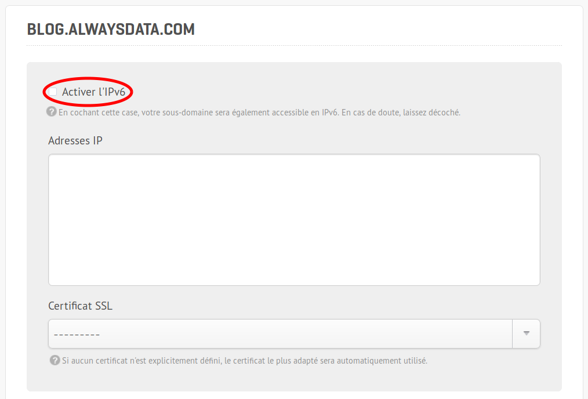

À compter du jeudi 8 février (soit, dans une semaine), nous activerons le support d'IPv6 automatiquement pour vos sous-domaines. Petit tour des changements à anticiper pour en profiter pleinement (*spoiler* : vous n'avez normalement rien à faire, on se charge de tout).

## IPv6, kézako ?

On ne va pas vous refaire un énième billet sur [ce qu'est IPv6](https://fr.wikipedia.org/wiki/IPv6), et [pourquoi c'est un bien nécessaire](http://www.lemonde.fr/technologies/article/2013/09/27/comment-internet-mue-vers-sa-nouvelle-version_3483861_651865.html), d'autres [s'en sont chargés](http://www.bortzmeyer.org/search?pattern=ipv6) avant nous. On vous rappellera juste que, face à la pénurie d'adresses IPv4, il était indispensable de passer sur un système plus robuste. Mais le déploiement d'IPv6 a pris du retard, et reste encore parfois boiteux à certains endroits du réseau.

Actuellement, le [taux d'utilisation d'IPv6 sur les principaux réseaux en France](https://www.arcep.fr/index.php?id=13726) est encore limité (de 35% chez Free, à moins de 1% chez Bouygues et SFR). Le support global n'est pas forcément meilleur, avec un taux de [27% des sites accessibles en IPv6](http://www.worldipv6launch.org/measurements/). Les rapports récemment publiés en décembre montrent qu'il y a encore du travail.

Chez *alwaysdata*, nous avons apporté le support d'IPv6 depuis 2008 déjà, ce qui, à l'époque, était une exception technique. Mais du fait de notre infrastructure à ce moment-là, notamment parce que nous nous appuyions sur l'architecture d'un prestataire, la qualité de service liée à IPv6 était imparfaite. Depuis la [fin de la migration](/fr/docs/caracteristiques-techniques/migrations/architecture-logicielle-2017/) nous sommes enfin à même de vous proposer un support de qualité pour IPv6 par défaut, en étant garants de nos infrastructures.

## Qu'est-ce que ça change ?

Concrètement : rien. Tous nos services supportent déjà depuis longtemps IPv6, aussi bien pour les mails (IMAP, SMTP), les accès distants (SSH, FTP…), que pour les services Web (HTTP, bases de données…). D'ailleurs, vous pouviez déjà l'activer depuis l'interface d'administration (Domaines > Détails > Sous-domaines > Modifier > Activer l'IPv6) (oui, c'était peut-être un peu caché, mais c'est un réglage dépendant du sous-domaine) :

Désormais, ce réglage va disparaître, et vos sites seront directement accessibles via IPv6 sans aucune manipulation de votre part.

Techniquement, il s'agit pour nous de déclarer systématiquement l'enregistrement DNS *AAAA* associé à l'IP de vos sous-domaines. Rien de plus n'est nécessaire. Il est à noter que si vous hébergez vos DNS ailleurs que chez *alwaysdata*, il vous faudra déclarer vous-même dans votre service DNS l'enregistrement *AAAA* concerné pour offrir ce support.

La bascule vers l'IPv6 est automatique : si vous disposez d'une IPv6 sur votre machine (servie par votre FAI), son usage est prioritaire sur IPv4, et vous contacterez vos services et sites par cette adresse automatiquement.

## Du coup, je ne fais rien, c'est ça ?

C'est ça.

La seule exception concerne vos applications web. Si votre app garde la trace de vos visiteurs en enregistrant leur adresse IP (en base de données par exemple), il vous faudra veiller qu'elle est bien compatible avec IPv6 : la longueur de chaîne de caractères pour représenter une IPv4 et une IPv6 est différente, et vous pourriez ne pas enregistrer ces informations correctement.

Hormis ce cas d'usage, rien n'est à prévoir de votre côté, le passage sera transparent.

## Ça apporte quoi, finalement ?

D'abord, ça permet de contourner la pénurie d'IPv4, et là, c'est un passage obligatoire, nous sommes clairement à court depuis des années.

Ensuite, du fait d'une part de l'architecture différente des [en-têtes de paquets entre IPv4 et IPv6](https://teamarin.net/2014/07/02/ipv6-effects-web-performance/), et d'autre part de la [qualité de connexion en IPv6](https://labs.ripe.net/Members/gih/examining-ipv6-performance) (faute d'adresses IPv4, il est courant de passer par du NAT, qui échoue beaucoup plus souvent), on trouve un léger gain de performance sur les applicatifs web.

