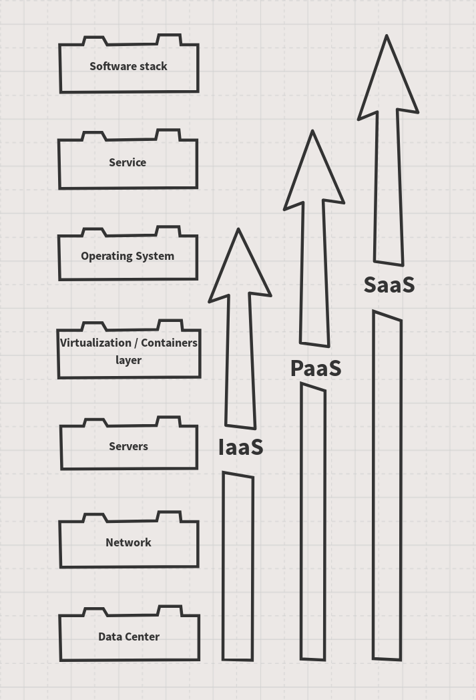
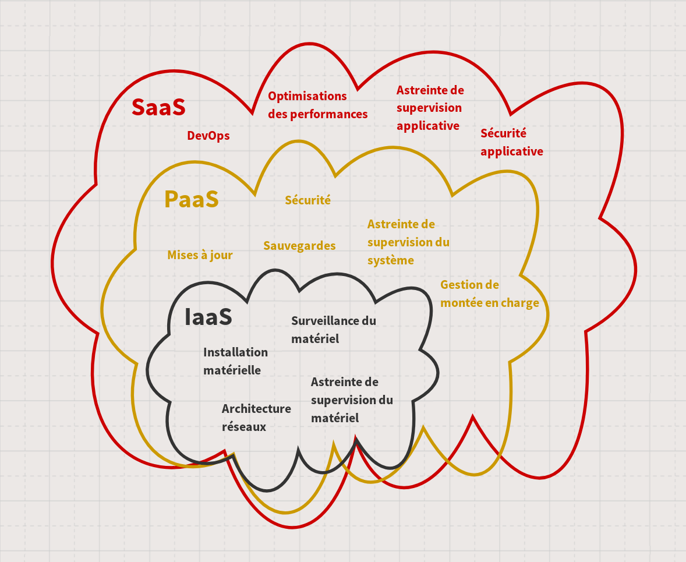

On nous pose souvent des questions qui sont légitimes pour qui ne connait pas *alwaysdata*. Parmi elles, l'une qui revient souvent est celle du prix, annoncé comme trop élevé face à certaines offres vues comme concurrentes. Cette incompréhension est due à des différences fondamentales entre ces offres. Pour ne plus comparer patates et carottes, et parce que nous comprenons très bien que ce ne soit pas évident[^1], tâchons d'expliquer ce que nous faisons chez *alwaysdata*.

## Qu'est-ce que le *Cloud* ?

Dans les *data centers*, on trouve des serveurs[^2], des équipements réseaux — routeurs, *switchs* —, des câbles (beaucoup, beaucoup de câbles) pour les connecter, et probablement des systèmes de stockage distant — comme des [SAN](https://fr.wikipedia.org/wiki/R%C3%A9seau_de_stockage_SAN) (Storage Area Network) par exemple.

Si vous avez besoin de rendre vos applications disponibles en ligne[^3], il vous faudra pousser votre code sur ces serveurs. Votre application sera alors accessible à distance à vos utilisateurs.

Pour exécuter votre code, vous devrez vous appuyer sur une infrastructure d'outils complexes, qui devront être disponibles sur votre hébergement. La réalité, c'est qu'il va falloir s'occuper de ces outils. Et c'est exactement ce que nous faisons à *alwaysdata* : nous ne nous contentons pas de vous louer une machine ou un espace, nous le gérons pour vous.

## Derrière le brouillard

Comme nous le disions, les serveurs-dans-le-nuage sont juste des ordinateurs. Voyons de quoi nous avons besoin pour les faire fonctionner.

*TL;DR* : ce passage est assez dense, si vous ne souhaitez pas entrer dans les détails, je vous conseille de passer à [la suite](#infrastructure-plateforme-solution-_as-a-service-quelles-differences). Pour résumer : le *Cloud*, ce sont des infrastructures serveurs dans des *data centers*, reliées à Internet, et sur lesquelles doit être installée une couche logicielle capable de faire tourner votre propre application.

### Un *data center*

Ça peut être évident ou pas, mais il faut bien un endroit où installer, brancher, et faire fonctionner nos serveurs. Le *data center* héberge physiquement les machines, et fournit tout ce qui est nécessaire à leur fonctionnement (électricité, température contrôlée, accès sécurisés, etc).

### Du réseau

Il nous faut connecter les serveurs au reste du monde, donc une infrastructure réseau est indispensable. Ce qui implique des routeurs (pour se connecter aux fournisseurs d'accès à Internet), des *switchs* (pour distribuer le réseau aux machines), des *firewalls*, des systèmes anti-DDoS, des sondes, etc.

### Des serveurs

Oui, c'est trivial, mais il nous faut bien des machines pour pouvoir vous les louer. Les serveurs sont donc installés et configurés pour fournir des CPU, de la mémoire, de l'espace de stockage, peut-être des GPU pour des calculs intenses, etc. Ils peuvent être fabriqués par différents constructeurs, avec des caractéristiques techniques différentes (modèles et architectures de CPU, quantité de RAM, etc).

Ils sont la puissance brute de l'infrastructure.

### Une couche d'isolation (virtualisation ou conteneurisation[^4])

Il s'agit de solutions au niveau du noyau ou équivalent qui exécutent des machines virtuelles ou des conteneurs sur les machines physiques[^5] et leur fournissent l'accès aux ressources matérielles (mémoire, temps ou puissance CPU, espace disque, réseau, etc). Ces technologies isolent virtuellement les comptes sur le serveur en offrant aux utilisateurs un accès au système plus ou moins complet, même s'il ne s'agit pas de la machine physique.

### Un système d'exploitation

C'est le cœur applicatif de votre machine. Ça peut être un GNU/Linux, un BSD, un Unix, un Windows, ou n'importe quelle distribution orientée serveur. Il s'agit du pont entre le matériel — même virtualisé dans une couche d'isolation — et le reste de la couche applicative, pour lui fournir accès à la mémoire, au CPU, au réseau, etc. Sans OS, pas d'exécution possible.

### L'infrastructure logicielle

*Nous y voilà*.

Vous avez besoin d'exécuter votre code sur votre serveur, et ce code a des dépendances fortes à *beaucoup* d'outils et de bibliothèques. Il s'agit de bases de données, de serveurs (comme un serveur *HTTP*), d'interpréteurs (comme *Python*, *PHP*, *Node.js*, etc), peut-être de *brokers*, de solutions de caches, d'indexeurs, et autres. Il vous faudra également disposer d'accès distant, via *SSH* ou *FTP* ; peut-être d'un système de *versioning* également (sans doute *Git* ou *Mercurial*) pour gérer le déploiement ; des serveurs de messagerie seront aussi nécessaires, pas pour héberger vos boites emails — même si ça reste possible —, mais au moins pour permettre à votre application ou à votre système de remonter les alertes en cas de problème. Il vous faudra sécuriser la machine, mettre en place des *firewalls* et des systèmes de bannissement pour prévenir les attaques.

C'est une pile technique complexe et conséquente qui doit être installée, configurée, maintenue, mise à jour, et monitorée. Elle vient souvent avec une interface d'administration pour permettre sa configuration.

### Votre application

Félicitations 🎉 !

Vous avez finalement un serveur opérationnel. Vous pouvez y déployer votre application / site web / solution dans un contexte de production, et fournir ce service à vos utilisateurs.

Voilà ce qui se trouve dans le nuage. Quel que soit le service que vous souhaitez faire fonctionner en ligne, quel que soit votre fournisseur d'hébergement, la pile technique reste proche de celle-ci, parce que ce sont les briques essentielles au fonctionnement d'une infrastructure distante. Cela signifie que pour le service que vous souhaiterez faire fonctionner, vous devrez vous soucier de cette pile ; ou vous devrez trouver un partenaire qui saura s'en occuper pour vous.

## Infrastructure, Plateforme, Solution (*as-a-service*), quelles différences ?

Comme nous venons de le voir, cette pile technique nécessaire à l'exécution de votre service est conséquente, compliquée à construire de zéro, complexe à maintenir. Depuis quelques années, le marché s'est organisé autour de différentes compétences pour fournir ces services. C'est l'âge des prestations *as-a-service*. On peut identifier trois sortes d'offres qui ciblent des clients différents : *IaaS*, *PaaS*, *SaaS*. Heureusement, on peut les représenter de la façon suivante :

Les offres *as-a-service* sont globalement des paquets cadeaux marketing[^6] qui regroupent des offres de métiers qui existent depuis longtemps : sysadmin, architectes réseaux, experts sécurité, DevOps… Tous ces gens qui font tourner les machines dans les sous-sols pour vous assurer la qualité attendue de vos services en ligne.

### IaaS

*Infrastructure-as-a-service* est une solution qui offre l'accès minimal à la structure. Votre location vous donne accès à une machine à distance, qui peut être soit physique, soit virtuelle. Votre fournisseur s'occupe de gérer le *data center* — le sien propre ou celui de son sous-traitant —, l'accès réseau, les machines physiques, les routeurs, *switchs*, le stockage, et la couche de virtualisation dans le cas des VPS.

- **ce qui reste à votre charge** : vous avez sous votre responsabilité l'OS — souvent fourni par votre hébergeur dans une version minimale —, sa sécurité, la pile technique, les bibliothèques, outils, etc. Vous serez alors en mesure de déployer votre application, de la configurer pour la production, et de l'exécuter.
- **ce que vous devez anticiper** : administrer son serveur seul·e reste une lourde tâche. Vous allez devoir gérer vous-même tout le système de votre ou vos machines. Ce qui signifie assurer aussi les astreintes 24/7, les coûts salariaux — ou les coûts de temps — liés au sysadmin et au réseau, les responsabilités liées à la sécurité, au backup, à la remise en service en cas de pépin, etc. Ces compétences sont chères. C'est aussi pour vous la charge de gérer la performance des machines, les coûts de migration. C'est un point de fonctionnement critique dont vous devrez assumer seul·e la responsabilité.

À noter : le fournisseur d'une infrastructure *IaaS* peut lui-même s'appuyer sur une autre infrastructure *IaaS*, par exemple en louant des VPS sur des infrastructures physiques elles-même louées à un autre prestataire. Selon vos contraintes — juridiques ou techniques —, pensez à vérifier la façon dont fonctionne votre prestataire.

### PaaS

*Platform-as-a-service* fournit l'infrastructure comme *IaaS*, mais maintient également toute la pile système : OS, interpréteurs, bibliothèques, bases de données, sécurité, etc. Elle fournit souvent un moyen de gérer et de configurer la solution facilement. Ce peut être un utilitaire en ligne de commande, des fichiers de configuration dans votre projet, un dépôt versionné spécifique, ou une interface web pour un accès clickodrôme.

- **ce qui reste à votre charge** : tout ce qu'il vous reste à faire est de configurer votre application dans son contexte de production et de la déployer.
- **ce que vous devez anticiper** : c'est votre prestataire qui prend en charge tous les coûts de gestion et d'administration de l'infrastructure, du système, du réseau, et de la sécurité. C'est à vous de déployer votre application en revanche, il ne pourra pas nécessairement vous aider. De même, si la sécurité niveau système lui incombe, celle de votre application reste dans votre champ de compétence. Pour faire simple : les coûts de DevOps sont pour vous.

### SaaS

*Software-as-a-service* est une approche plus avancée où, en tant qu'utilisateur, vous souhaitez accéder à une solution logicielle existante sans avoir à la déployer. Dans ce type d'offre, votre abonnement vous donne accès au service en tant qu'utilisateur. Le fournisseur du-dit service, lui, utilise sa propre infrastructure ou plateforme, ou celle d'un sous-traitant. C'est le modèle principal retenu par les start-up technologiques.

- **ce qui reste à votre charge** : pour vous en tant qu'utilisateur, ces choix sont transparents : vous accédez simplement à l'application. Rien de plus.
- **ce que vous devez anticiper** : il vous sera impossible d'accéder au serveur pour l'adapter à vos besoins. Vous êtes limités à l'usage de l'application. C'est une solution qui vous permet un accès distant à une app ou un service, comme vous utiliseriez une app sur votre *smartphone*, guère plus. Si vous commencez à utiliser beaucoup d'applications dans ce sens, vos coûts d'abonnements risquent d'exploser (multipliés par le nombre d'utilisateurs × le nombre de services), et utiliser une offre *PaaS* où vous pouvez déployer toutes vos applications est sans doute plus adapté.

Faisons donc un petit dessin (j'aime bien les petits dessins) pour résumer tout ça. Dans chaque petit nuage, chaque rôle qui est compris dans le coût de votre abonnement et sur lesquels, par extension, vous n'avez donc pas la main directement :

## Vous faites quoi, chez *alwaysdata* ?

Nous sommes un fournisseur de solution *PaaS*. Nous sommes les [propriétaires de notre propre infrastructure technique](/fr/blog/2018-02-20-4-years-later-being-independent-feedback/), et nous maintenons pour vous l'ensemble du système qui vous est nécessaire pour offrir votre service à vos utilisateurs. Ceci aussi bien pour nos [Serveurs dédiés](https://www.alwaysdata.com/fr/offers/max) que pour notre [offre mutualisée](https://www.alwaysdata.com/fr/offers/plus). De notre point de vue, il n'y a aucune différence entre toutes nos offres. Elles utilisent la même plateforme, et la même infrastructure. La différence tient dans le fait que dans le cas des serveurs dédiés, vous êtes seul sur les instances, et vous ne partagez donc pas de ressources avec d'autres utilisateurs.

Nous avons fait le choix de ne pas être de simples fournisseurs *IaaS* depuis le début d'*alwaysdata* pour une raison simple : à l'époque, nous ne trouvions pas de solution offrant le niveau de fonctionnalités nécessaire et la flexibilité voulus dans les offres d'hébergement. Nous avons donc conçu la nôtre pour la proposer à tous. C'est la raison pour laquelle nous ne pouvons pas comparer notre offre et celle de fournisseurs de solutions *IaaS* : nous ne faisons simplement pas le même métier, ne fournissons pas les mêmes services, ni avec la même qualité.

*alwaysdata* vous apporte le support de tous les interpréteurs disponibles sur le marché, la possibilité de faire tourner n'importe quel programme dans votre espace utilisateur, d'exécuter des services en arrière-plan, différentes bases de données SQL et NoSQL, un accès SSH complet, et bien d'autres fonctionnalités ! Même en mutualisé, notre niveau de fonctionnalités est bien au-delà des solutions concurrentes qui ne mettent souvent à disposition que le support de PHP derrière une unique instance Apache, avec une base de données MySQL et sans accès SSH.

La performance et la sécurité sont par ailleurs au cœur de notre conception : nous ne nous appuyons pas systématiquement sur une couche de virtualisation pour uniquement gérer de l'isolation — comme nous pouvons souvent le voir ailleurs —, mais nous utilisons les fonctionnalités natives du noyau et de l'OS pour isoler les comptes. Ce système nous permet de vous fournir un haut niveau de performance sans compromis sur la sécurité. Nous utilisons bien entendu de la virtualisation à certains endroits de la plateforme, mais uniquement si c'est un choix de conception raisonné.

J'espère que cet article vous aura permis de mieux comprendre les différences entre les offres d'hébergement qui s'offrent à vous. Si vous ne nous connaissez pas encore, vous devriez [faire un essai](https://www.alwaysdata.com/fr/inscription/) pour voir ce à quoi devrait ressembler une offre *PaaS* moderne. Vous fournir l'environnement le plus confortable possible pour exécuter vos applications reste notre objectif, depuis le début !

---

[^1]: pas les patates et carottes, hein, je ne vous ferais pas cet affront — la nouvelle version du site devrait être beaucoup plus claire à ce sujet, mais ce n'est pas une raison pour faire attendre les explications
[^2]: qui sont donc des ordinateurs avec, la plupart du temps, de grosses capacités de calcul
[^3]: je vous parlerai prochainement du paradigme *server-less* dans un futur article, où nous découvrirons que même ce type de solution implique souvent… un serveur `¯\_(ツ)_/¯`
[^4]: là encore, je vous prépare un article sur les différences entre virtualisation, conteneurisation et isolation
[^5]: les puristes vont avoir déjà posé mon nom sur leur liste noire en lisant ça, j'espère que vous me pardonnerez pour ce raccourci : j'essaie de rester concis dans mes explications et la différence entre virtualisation et conteneurisation dans le contexte de l'hébergement est hors du périmètre de cet article
[^6]: mais c'est important le papier cadeau, c'est la promesse de beaucoup de joies
