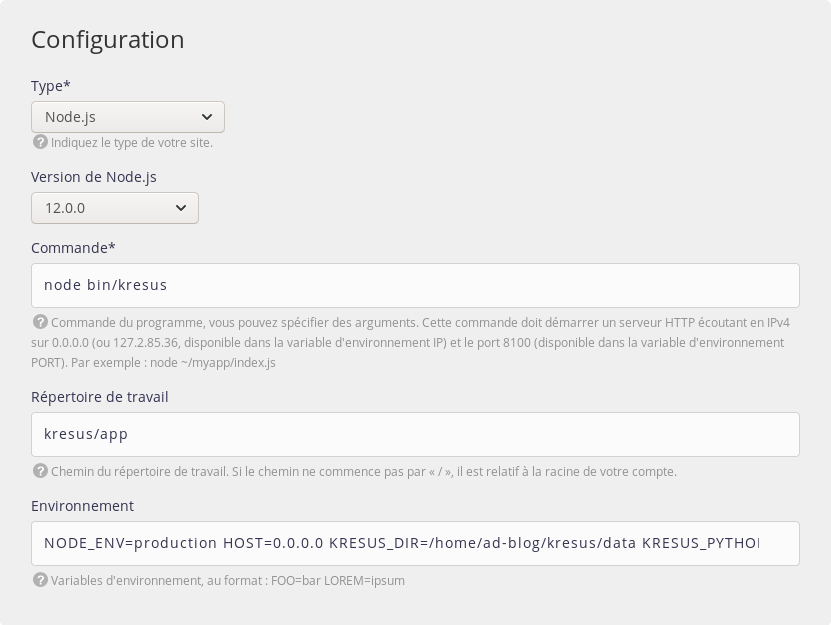

Nous sommes parfois confrontés à des cas d'utilisation où nous avons besoin de mélanger différentes technologies pour exécuter nos applications. C'est devenu un cas d'utilisation si commun qu'on le trouve à la base de l'architecture *micro-services*. Nous avons tendance à mélanger les technologies pour obtenir l'environnement le plus puissant qu'elles peuvent offrir.


## Exécuter différentes versions du même interpréteur

L'une des fonctionnalités les plus puissantes (et, malheureusement, l'une des moins connues) de l'architecture d'alwaysdata est le **commutateur de versions** !

alwaysdata a toujours eu pour objectif de vous fournir un large éventail d'interpréteurs : *PHP*, *Python*, *Node.js*, *Ruby*, *Erlang*… même *Perl* sont supportés dans votre compte alwaysdata. Mais nous avons parfois besoin d'une version spécifique. Qu'en est-il si vous avez besoin d'exécuter une application qui nécessite une version minimale ? Disons, *Node.js 10* ? Votre compte est *pré-provisionné* avec un large éventail de versions pour chaque langage. Par exemple, *Node.js* est livré avec toutes les versions suivantes (au moment où j'écris ces lignes) :

- 12.0.0
- 11.12.0
- 11.8.0
- 11.1.0
- 11.0.0
- 10.15.3
- 10.15.1
- 10.13.0
- 10.12.0
- 10.9.0
- 9.11.2
- 8.15.1
- 8.15.0
- 8.12.0
- 8.11.4
- 6.17.0
- 6.16.0
- 6.14.4

Wow. Ça fait… *beaucoup* !

Nous pouvons donc spécifier la version à utiliser grâce au commutateur de versions, sous forme d'une *variable d'environnement* :

```shell
$ NODEJS_VERSION=11.8.0 node --version
v11.8.0
```

Il est également possible d'être moins spécifique pour s'en tenir à la dernière *release majeure* d'une version donnée :

```shell
$ NODEJS_VERSION=11 node --version
v11.12.0
```

Le *commutateur de versions* est disponible pour **tous** les interpréteurs intégrés dans votre compte : `PYTHON_VERSION`, `PHP_VERSION`, *etc*. Vous pouvez récupérer une liste de toutes les versions disponibles dans la page dédiée au langage concerné dans votre interface d'administration : Environnement > *[Langage]*.

## Mélangez-les tous : le cas d'utilisation [Kresus](https://kresus.org)

Cas pratique avec le projet [Kresus](https://kresus.org). *Kresus* est un gestionnaire de finances personnelles qui peut se connecter à votre compte bancaire en ligne en utilisant une bibliothèque dédiée : [Weboob](http://weboob.org). L'ensemble de manière auto-hébergée, puisque, nous l'avons déjà dit : [la vie privée est importante](/fr/blog/2018-01-28-why-does-privacy-matter/).

Mais *Kresus* est écrit en *Node.js* et attend une version de `node` >= 10, quand *Weboob* est écrit en *Python* et nécessite `python` >= 3. Alors mélangeons-les !


Connectez-vous à votre compte en utilisant *SSH*, et créez un répertoire pour héberger le projet :

```shell
$ mkdir ~/kresus
$ cd ~/kresus
```

### Installer Weboob

Nous allons créer un `virtualenv` Python pour *Weboob* qui hébergera la bibliothèque et ses composants :

```shell
$ PYTHON_VERSION=3 python -m venv ~/kresus/weboob
$ source ~/kresus/weboob/bin/activate
(weboob) $ pip install git+https://git.weboob.org/weboob/weboob.git
(weboob) $ weboob-config update
(weboob) $ deactivate
```

### Installer Kresus

Nous sommes maintenant prêts à installer le gestionnaire *Kresus*. Nous devons d'abord installer le gestionnaire de paquets `yarn`, car *Kresus* s'en sert pour les tâches de compilation :

```shell
$ NODEJS_VERSION=12 npm install --global yarn
```

C'est une *autre puissante fonctionnalité* du PaaS alwaysdata : même si vous n'êtes pas `root`, vous pouvez installer les dépendances **de manière globale** ! Grâce à nos fonctionnalités de *wrapping*, tout est isolé dans votre compte, et considéré comme un outil système par vos gestionnaires de paquets !

Installons maintenant le projet :

```shell
$ git clone https://framagit.org/kresusapp/kresus.git ~/kresus/app
$ cd ~/kresus/app
$ NODEJS_VERSION=12 npm install
$ NODEJS_VERSION=12 npm run build:prod
```

### Lancer le service

Nous sommes prêts à faire fonctionner le service !

Créez un [nouveau site](/fr/docs/hebergement-web/sites/ajouter-un-site/) dans votre panneau d'administration à *Web > Sites > Ajouter un site*. Sélectionnez un site *Node.js* et spécifiez la version `12.0.0`.



Voici les paramètres :

- Commande : `node bin/kresus`
- Répertoire de travail : `kresus/app`
- Environnement : `NODE_ENV=production HOST=[IP] KRESUS_DIR=/home/[username]/kresus/data KRESUS_PYTHON_EXEC=/home/[username]/kresus/weboob/bin/python KRESUS_SALT=[longue chaîne aléatoire]`

Veillez à remplacer les valeurs suivantes :

- `IP` : l'*IPv4* sur laquelle l'application doit écouter, indiqué sous le champ *Commande*. Cette adresse est spécifique à chaque application, et les outils Node.js s'attendent généralement à ce qu'elle soit exposée par la variable d'environnement `HOST` (nous travaillons sur ce point).
- `nom d'utilisateur` : le nom de votre compte alwaysdata
- `longue chaîne aléatoire` : une chaîne aléatoire d'au moins 16 caractères utilisée par *Kresus* pour sécuriser les sessions.

Vous pouvez également vérifier l'option *Forcer le HTTPS* dans l'onglet SSL pour assurer une connexion sécurisée.

Terminé ! Lancez votre application en visitant l'URL du site. La première connexion peut prendre un peu de temps en raison de l'initialisation de la base de données, ainsi que la récupération du premier compte bancaire. Prenez un café et soyez patient.


Ce n'est qu'un petit exemple des puissantes fonctionnalités que nous offrons sur alwaysdata.

Au cours des prochaines semaines, nous migrerons notre plateforme vers une nouvelle version et nous introduirons une nouvelle fonctionnalité à la surcouche de *wrapping* pour vous permettre d'accéder à la version de votre choix de n'importe quel interpréteur. Le *commutateur de versions* reste disponible, mais vous pourrez utiliser directement `node12` ou `python3.7` plutôt que de passer par les variables d'environnement.

Rendez-vous dans quelques semaines pour ces nouvelles fonctionnalités ! D'ici là, [lancez votre propre instance de *Kresus*](https://www.alwaysdata.com/fr/inscription/) !
