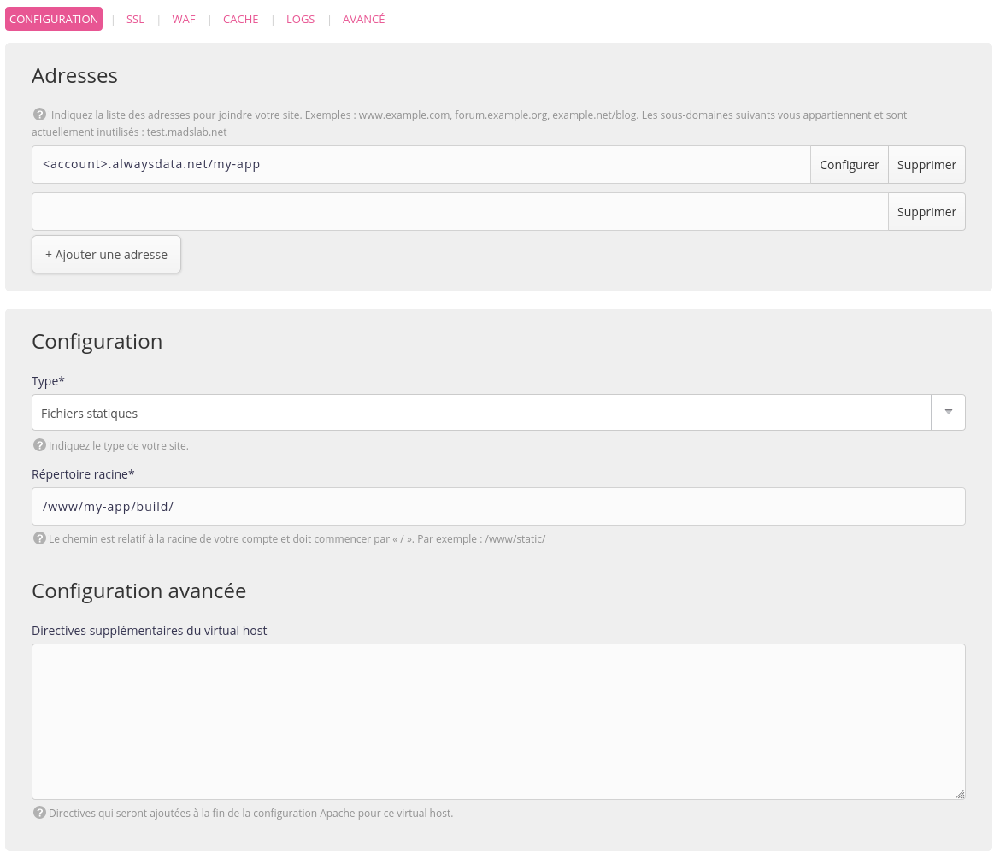
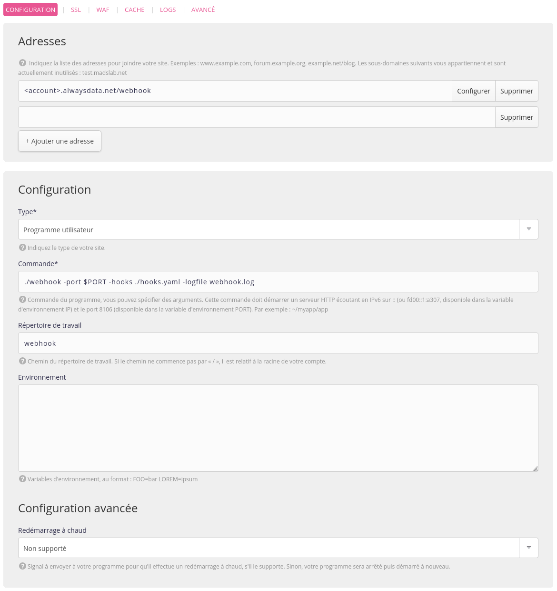
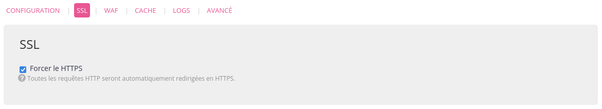
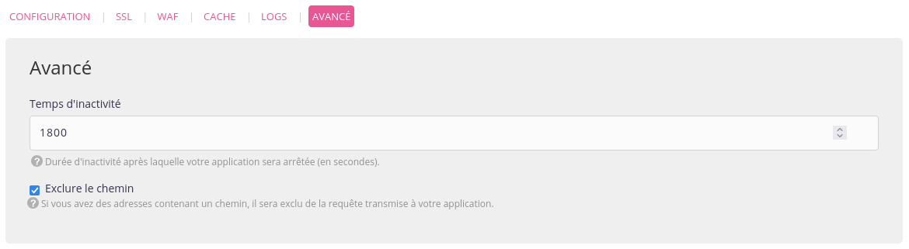

Dans un écosystème *front-end* toujours plus avancé, toujours plus riche en *frameworks*, avec un *tooling* toujours plus exigeant, on peut parfois se retrouver dans une situation cocasse : comment gérer un déploiement fiable et efficace ? Cas d’école avec **Create React App**, c’est parti !


> [!NOTE] Note lexicale
> Ce guide se déroulera dans deux environnements :
> - *Local* : ces commandes sont à exécuter sur votre environnement de développement local (Probablement : votre laptop) ;
> - *Serveur* : sur votre compte d’hébergement. Chez **alwaysdata**, vous pouvez vous connecter en *SSH* pour exécuter ces commandes.
>
> Dans le cas d’un hébergement chez **alwaysdata**, les mentions `<account>` dans les chemins/URLs/etc. font référence à votre nom de compte (*i.e.* si votre nom de compte est `superman`, remplacez `<account>` par `superman`)


## *Create React App*, c’est quoi ?

Que vous ayez manqué les dernières années du développement *front-end*, ou que vous soyez un peu perdu dans vos premiers pas avec *React*, petit rappel : **React** est un framework *JS/TypeScript* qui vous offre un environnement de développement pour vos sites et applications Web. J’insiste sur la partie *front-end* du sujet : même s’il est possible d’utiliser *React* avec une partie de rendu côté serveur, son cas d’usage premier est bien de générer des *assets front* : *HTML, CSS, JavaScript*. Rien de plus.

Puisqu’une app *React* n’est qu’un ensemble de fichiers statiques, pas besoin d’avoir une architecture *backend* complexe pour servir votre *front-end*. Ni serveur *Node.js*, ni rien. Un simple serveur Web HTTP suffit. Comme l’indique la [documentation de déploiement de *Create React App*](https://create-react-app.dev/docs/deployment/) :

> Set up your favorite HTTP server so that a visitor to your site is served `index.html`, and requests to static paths like `/static/js/main.<hash>`.js are served with the contents of the `/static/js/main.<hash>.js` file.

J’en profite pour ajouter un mot sur *Create React App*. Si *React* est un framework dédié à la conception d’applications Web, la mise en place de tout son *tooling* peut s’avérer complexe. Des outils encaspulant toute cette logique sont donc apparus pour vous faciliter les choses.

## Le dev vs. la prod

Commençons notre tutoriel en créant une nouvelle application basée sur *React* en utilisant *Create React App*. Dans votre environnement local, lancez la commande :

```shell
$ npx create-react-app my-app
$ cd my-app
```

Félicitations, voici votre première application *React* fonctionnelle (et sans avoir codé quoi que ce soit !). *Create React App* a généré les fichiers de base, et installé les différents modules nécessaires au développement et à la compilation de votre projet.

La compilation ? Eh oui ! Votre application *front* ne va pas être directement servie à vos clients, mais va devoir être transpilée vers JavaScript. *Create React App* a doté votre projet de deux commandes :

- `npm start` : c’est votre commande en mode développement ; elle va lancer un serveur web sur votre machine pour vous permettre de travailler sur votre application confortablement (avec du *hot-reloading*, etc.) ;
- `npm run build` : c’est la commande dédiée à la *transpilation*, celle qui va produire les *assets* statiques que vous devrez ensuite déployer côté serveur.

Côté serveur à présent : dans votre interface d’administration *alwaysdata*, créez un nouveau site de type **Fichiers statiques**, avec les informations suivantes :

- adresse : `<account>.alwaysdata.net/my-app`
- répertoire de travail : `www/my-app/build`



Comme ce répertoire n’existe pas encore, créez-le depuis votre environnement local via *SSH* :

```shell
$ ssh <account>@ssh-<account>.alwaysdata.net mkdir -p www/my-app/build
```

## Déploiement manuel : l’option simple et rapide

Tout est prêt côté serveur pour recevoir votre site *React* ! En-avant pour le déploiement.

Vous devez d’abord indiquer l’*URL* final de votre projet dans le fichier `package.json` pour permettre à la tâche de *build* de générer les *assets* avec les bons chemins de fichiers. Ajoutez l’entrée suivante :

```
"homepage": "//<account>.alwaysdata.net/my-app"
```

Toujours depuis votre environnement local, lancez la tâche de *build* :

```shell
$ npm run build
```

Votre obtenez un répertoire `build` qui contient vos assets statiques. Pour les déployer, utilisez *rsync* via *SSH* :

```shell
$ rsync -rz build <account>@ssh-<account>.alwaysdata.net:www/my-app
```

Vous pouvez vous rendre à l’adresse de votre site, et admirer la première mise en prod. de votre application !

## Déploiement automatisé depuis Github : la solution des pros

Ce déploiement manuel fonctionne parfaitement, mais il fait reposer la charge sur vos épaules. À chaque fois que vous voudrez déployer votre projet, vous devrez lancer la tâche de *build* puis lancer le déploiement des fichiers via *rsync/SSH*.

Entrons dans la partie *DevOps* en automatisant le processus via des *Webhooks GitHub* !


### *Webhooks*, le lien automagique

Avec les *webhooks*, c’est désormais *GitHub* qui va prévenir votre site qu’une nouvelle version est disponible chaque fois que vous pousserez de nouveaux *commits* sur la branche `main` principale.

Pour ça, il va falloir doter votre compte *alwaysdata* d’un service de *webhooks* qui exécutera la tâche de déploiement à votre place. Le projet [adnanh/webhook](https://github.com/adnanh/webhook/) fera très bien l’affaire. Connectez-vous sur votre compte via *SSH* et installez-le :

```shell
$ mkdir webhook
$ wget -O- https://github.com/adnanh/webhook/releases/download/2.8.0/webhook-linux-amd64.tar.gz \
  | tar -xz --strip-components=1 -C webhook
```

Créez ensuite un nouveau site dans votre interface d’administration *alwaysdata* de type **Programme utilisateur** avec les informations suivantes :

- adresse : `<account>.alwaysdata.net/webhook`
- répertoire de travail : `webhook`
- commande à exécuter : `./webhook -port $PORT -hooks ./hooks.yaml -logfile webhook.log`
- pensez également à cocher les cases *Forcer le HTTPS* et *Exclure le chemin*.





### *GitHub*, le Central Perk

Côté *GitHub* à présent, nous allons configurer un nouveau dépôt pour notre projet. [Créez-le comme d’habitude](https://github.com/new) en lui donnant le nom de votre projet.


Puis rendez-vous dans la partie *Settings* pour ajouter un nouveau *webhook* vers votre serveur :

- payload URL : `https://<account>.alwaysdata.net/webhook/hooks/deploy`
- secret : *un mot de passe aléatoire*
- content-type : `application/json`


### Nono, le petit robot

Notre dépôt *GitHub* est configuré, il va maintenant déclencher des requêtes vers votre serveur *webhooks* lors de nouveaux évènements, comme les `git push`. Il ne nous reste plus qu’à automatiser le déploiement.

Connectez-vous en SSH et créez le fichier `webhook/hooks.yaml` pour configurer vos *webhooks* :

```yaml
- id: deploy
  execute-command: /home/<account>/webhook/deploy.sh
  command-working-directory: /home/<account>
  pass-arguments-to-command:
    - source: payload
      name: repository.name
    - source: payload
      name: repository.clone_url
    - source: payload
      name: head_commit.id
  trigger-rule:
    and:
      - match:
          type: payload-hmac-sha1
          secret: <github_webhook_secret>
          parameter:
            source: header
            name: X-Hub-Signature
      - match:
          type: value
          value: refs/heads/main
          parameter:
            source: payload
            name: ref
```

*Note* : pensez à remplacer les valeurs de `<account>` et de `<github_webhook_secret>` dans cette configuration, puis à [redémarrer le site *webhook*](https://admin.alwaysdata.com/site/) dans l’interface d’aministration une fois terminé.

Ce *webhook* `deploy` définit l’action à exécuter lors d’une notification *GitHub*. Il va appeler le script `webhook/deploy.sh` avec plusieurs paramètres, uniquement quand il s’agit d’un *push* sur la branche `main`.

Il ne manque plus que le script de déploiement proprement-dit, celui qui sera exécuté par le serveur de *webhooks* lors de la notification. Il aura les tâches suivantes à réaliser :

1. Cloner le repository dans un répertoire temporaire ;
2. Récupérer la dernière version indiquée par *GitHub* dans sa notification ;
3. Réaliser la tâche de *build* ;
4. Tout nettoyer derrière-lui.

Toujours via *SSH*, ajoutez le script `webhook/deploy.sh` sur votre compte serveur :

```shell
#!/bin/bash
 
NAME=$1
URL=$2
COMMIT=$3
 
CLONE_DIR=$(mktemp -d)
DEST_DIR=${HOME}/www/${NAME}
 
mkdir -p ${DEST_DIR}
 
git clone --bare ${URL} ${CLONE_DIR}
git --work-tree ${DEST_DIR} --git-dir=${CLONE_DIR} checkout --force ${COMMIT}
npm --prefix=${DEST_DIR} install
npm --prefix=${DEST_DIR} run build
rm -rf ${CLONE_DIR}
```

*Note* : pensez à rendre le fichier exécutable avec la commande `chmod +x webhook/deploy.sh`.

Vous y êtes ! Plus qu’à laisser l’ensemble se dérouler. Retournez dans votre environnement local, et ajoutez le dépôt *GitHub* à votre projet avant de pousser la branche principale :

```shell
$ git remote add origin https://github.com/<gh_name>/my-app.git
$ git push -u origin main
```

Ce push va déclencher la notification via les *webhooks* ; le serveur côté *alwaysdata*, une fois prévenu, va dérouler le script de déploiement, et votre site sera mis à jour. Vous pouvez vérifier le bon déroulement en consultant côté serveur le fichier `webhook/webhook.log`.


Faites des modifications sur votre site, poussez sur *GitHub*, rechargez votre site à l’adresse `http://<account>.alwaysdata.net/my-app`, et admirez ! Vous n’avez plus rien à faire pour gérer vos déploiements.


## Le bon *PaaS*, c’est celui qui vous convient

Pas besoin de solutions comme *Netlify*, *Heroku*, ou autre pour gérer la partie **DevOps** de vos déploiements. Même si ces plate-formes proposent de nombreux outils pratiques pour faciliter vos mises en production (comme les déploiements atomiques, etc), rien ne vous contraint à les utiliser.

Nous avons ici mis en place une solution simple pour automatiser du déploiement d’applications *front-end* statiques sur votre compte *alwaysdata* sans passer par des outils tiers. Notre outil de déploiement étant indépendant de l’application en elle-même, vous pouvez dès maintenant vous en servir pour déployer d’autres projets : dans un autre dépôt *GitHub*, configurez un *webhook* pointant vers le même *endpoint* avec le même `secret`, et observez vos déploiements se faire seuls dans votre répertoire `www`.

Libre à vous maintenant d’adapter la solution à des cas plus complexes, intégrant des tâches de migration, de mise à jour de bases de données, de *build* atomique pour prévenir les interruptions de services le temps du redéploiement… la liste est longue. À vos claviers 🤓 !
