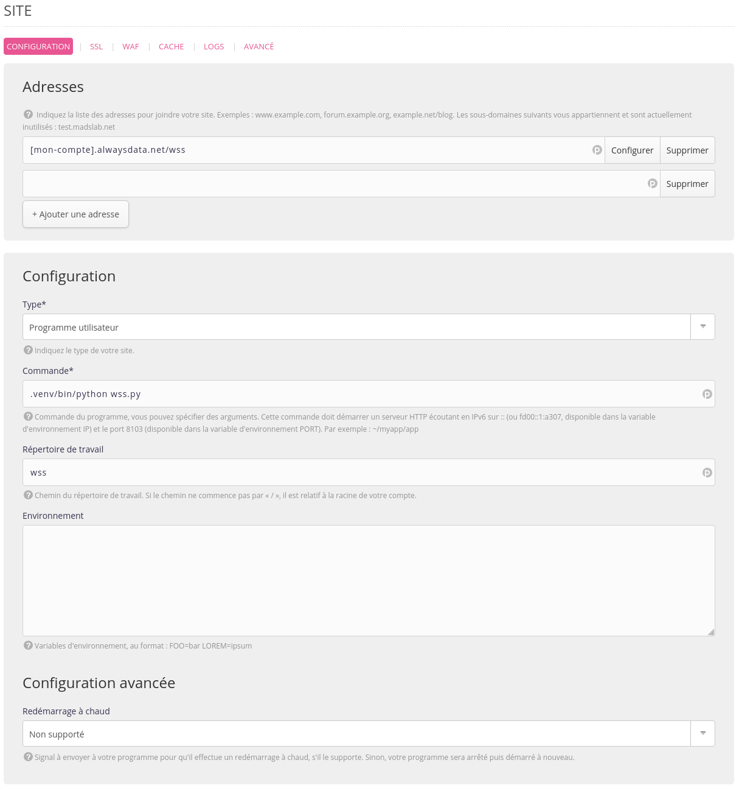
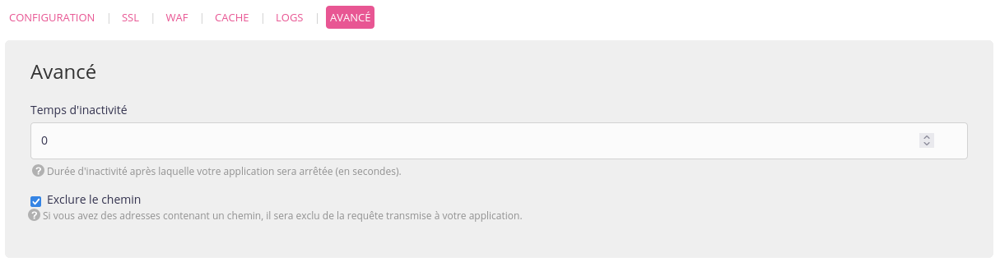
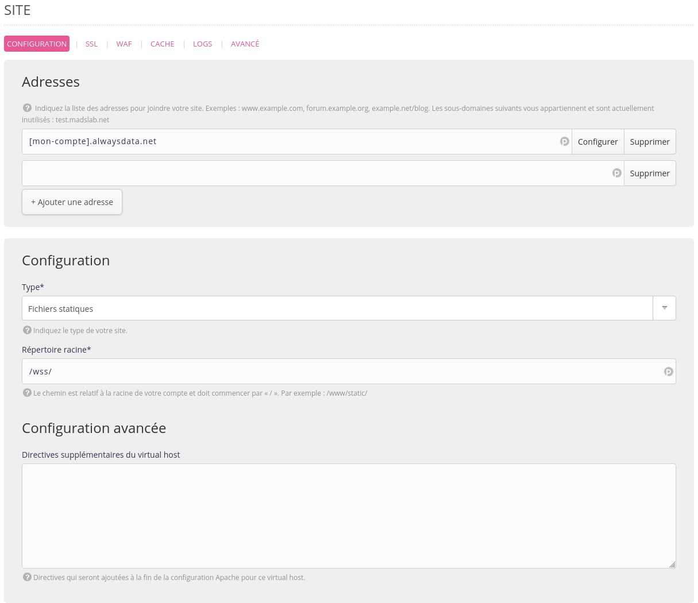

Créé par [WHATWG](https://websockets.spec.whatwg.org) en 2011 et normalisé par l'[IETF](https://datatracker.ietf.org/doc/html/rfc6455) la même année, le protocole [WebSocket](https://fr.wikipedia.org/wiki/WebSocket) offre depuis plus de 10 ans la possibilité aux développeurs d'applications Web de s'affranchir du modèle Client/Server TCP traditionnel pour le transfert de données en temps réel.

Dans ce modèle initial, le client requête auprès du serveur une ressource, ce dernier la lui retourne, fin de la communication. Il n’est notamment pas possible pour le serveur de « pousser » facilement des messages au client (comme des notifications).

WebSocket apporte le support d’une communication bidirectionnelle (dite *full-duplex*) dans laquelle le serveur peut désormais spontanément « pousser » de la donnée vers le client ; et où le client peut souscrire aux messages qui l’intéressent pour y réagir ensuite. L’interactivité applicative, directement dans le navigateur !

En 2023, héberger une application serveur WebSocket, comment ça marche ?


## Attention chérie, ça va trancher

Revenons aux fondamentaux : WebSocket est un protocole réseau dans la couche application (dans le fameux [modèle OSI](https://fr.wikipedia.org/wiki/Mod%C3%A8le_OSI)). Pas besoin d'être expert en réseau pour l'utiliser, donc : c'est au niveau du code que tout va se passer. Il exploite une connexion TCP traditionnelle entre le client et le serveur, et l'architecture HTTP.

Pour faire simple :

1. le client va charger auprès du serveur une première ressource applicative (HTML + JS) ;
2. cette ressource va être en charge d'établir une communication auprès du serveur WebSocket pour en recevoir les notifications ;
3. le serveur WebSocket va enregistrer le client dans ses destinataires et lui poussera la data concernée quand ce sera nécessaire ;
4. le client, jusqu'alors en attente, recevra les flux de data en provenance du serveur et pourra traiter cette donnée.

On notera que dans WebSocket, il y a *Web* : l'architecture n'est pas différente des applications Web traditionnelles. On exploite toujours HTTP/TCP, on utilise juste un autre protocole applicatif. Ce qui signifie que l'on va devoir utiliser des librairies dédiées.

## Un service qui fait « pong »

Il existe plein de bibliothèques capables de vous proposer le support WebSocket, dans à peu près tous les langages Web disponibles. Pour les besoins de la démonstration[^1], nous allons implémenter un petit serveur WebSocket en Node.js, puis en Python. Libre à vous de le réaliser en PHP, en Ruby, en Java, en Perl…

Notre exemple est tout simple : une fois connecté, notre client pourra envoyer le message `ping` au serveur, qui renverra alors `pong` à tous les clients connectés, une seconde plus tard. Ce simple exemple démontre l’interactivité entre tous les éléments connectés (c’est à dire du *broadcasting*) de notre application.

### En Node.js…

À l’heure actuelle la librairie la plus réputée pour réaliser une application serveur WebSocket en Node.js est [websockets/ws](https://github.com/websockets/ws). Ajoutez le paquet `ws` à votre projet via `npm`[^2], et créez un fichier `wss.js` pour votre serveur WebSocket :

```javascript
import WebSocket, { WebSocketServer } from 'ws';
 
const wss = new WebSocketServer({
  host: process.env.IP || '',
  port: process.env.PORT || 8080
});
```

Nous attachons le serveur WebSocket au couple `IP`/`PORT` exposé dans les variables d’environnement pour plus de flexibilité, avec un fallback vers le port `8080` pour faciliter le développement.

Notre serveur est prêt, reste à le doter de ses fonctionnalités. Tout d’abord, il doit pouvoir recevoir les connexions des clients :

```javascript
wss.on('connection', (ws) => {
  // log as an error any exception
  ws.on('error', console.error);
});
```

Ensuite, lorsqu’un client enverra le message `ping`, il devra renvoyer `pong` à tous les clients actifs :

```javascript
wss.on('connection', (ws) => {
  /* ... */
  ws.on('message', (data) => {
    // only react to `ping` message
    if (data != 'ping') { return }
    wss.clients.forEach((client) => {
      // send to active clients only
      if (client.readyState != WebSocket.OPEN) { return }
      setTimeout(() => client.send('pong'), 1000);
    });
  });
});
```

Rien de plus. Pour lancer le serveur WebSocket, exécutez simplement le fichier `wss.js` avec Node.js :

```shell
$ node wss.js
```

### … ou en Python !

Pour changer un peu des exemples habituels, réalisons le même serveur WebSocket en Python, à l’aide d’*asyncio* et de [websockets](https://pypi.org/project/websockets/). Commencez par installer le paquet `websockets` à l’aide de `pip` dans votre venv, puis créez un fichier `wss.py`.

```python
#!/usr/bin/env python
 
import os
 
import asyncio
import websockets
 
 
async def handler(websocket): pass
 
 
async def main():
    async with websockets.serve(
        handler,
        os.environ.get('IP', ''),
        os.environ.get('PORT', 8080)
    ):
        # Run forever
        await asyncio.Future()
 
 
if name == "__main__":
    asyncio.run(main())
```

Définissons maintenant nos fonctionnalités : enregistrement des clients et diffusion du message lors d’un `ping`. Enrichissez la méthode `handler` qui contient la logique de notre serveur :

```python
connected = set()
 
 
async def handler(websocket):
    if websocket not in connected:
        connected.add(websocket)
    async for message in websocket:
        if message == 'ping':
            await asyncio.sleep(1)
            websockets.broadcast(connected, 'pong')
```

### Le client Web

Notre client va rester simple : une page web embarquant directement le JavaScript à exécuter pour se connecter au serveur WebSocket, et envoyer un `ping` lors de la connexion. Il disposera aussi d’une méthode pour renvoyer un nouveau `ping` manuellement.

Créez un fichier `index.html` pour votre client :

```xhtml
<!DOCTYPE html>
<script>
    WS_SERVER = 'localhost:8080'
    dateFormatter = new Intl.DateTimeFormat('en-US', {
        hour: "numeric",
        minute: "numeric",
        second: "numeric"
    })
 
    const websocket = new WebSocket(`ws://${WS_SERVER}/`)
 
    const ping = (msg) => {
        msg = msg || 'ping'
        console.log("Send message", msg)
        websocket.send(msg)
    }
 
    websocket.addEventListener('message', ({data}) => {
        console.log("Recv message", data, dateFormatter.format(Date.now()))
    })
 
    websocket.addEventListener('open', () => ping())
</script>
<p>Open the developer console and run the <code>ping()</code> function</p>
```

Lancez votre serveur WebSocket (Python ou Node.js) et ouvrez cette page HTML avec les devtools ouverts. Vous devriez voir apparaître les messages de `ping`/`pong` dans la console. Essayez en exécutant manuellement la fonction `ping()` dans les devtools.

Ouvrez maintenant une seconde fois cette page HTML dans un autre onglet, devtools ouverts. Exécutez la fonction `ping()` indifféremment dans l’un des deux onglets. Les deux vont recevoir le `pong` depuis le serveur.

Félicitations, vous avez un premier niveau de communication broadcast bi-directionnelle client/serveur en *full-duplex* via WebSocket !


## Noot Noot : WebSite ou WebService ?

Il nous reste à déployer ce serveur WebSocket et le client dans un environnement de production.

Chez **alwaysdata** nous proposons plusieurs solutions pour déployer des outils devant être exécutés en temps long, c’est à dire de manière joignable dans le futur par un client : les *Sites*, et les *Services*.

Pour les *Sites*, pas besoin de faire un dessin : il s’agit de déployer un serveur Web (Apache, WSGI, Node, etc.) qui sera requêté ultérieurement par un client pour obtenir différentes ressources via HTTP. Le Web historique traditionnel.

Les *Services*, eux, sont destinés à exécuter des processus longs, potentiellement joignables autrement que par HTTP, dans l’environnement de votre compte (un serveur de dépôts Git over SSH avec [soft-serve](https://github.com/charmbracelet/soft-serve) ou un système de surveillance / filtrage de messagerie, par exemple).

Alors, pour un serveur WebSocket, *Sites*, ou *Services* ?

Si on pourrait imaginer que les Services sont le bon endroit — *un processus long potentiellement joignable de l’extérieur *— je le répète ici : dans WebSocket, il y a *Web* ! Le protocole WebSocket est logiciel et exploite HTTP/TCP, comme n’importe quel *Site*.

### Un plan sans accroc

Votre application se compose de deux briques : un client, et un serveur WebSocket. Le serveur WebSocket ne peut pas servir de ressource comme un serveur Web traditionnel (ce n’est pas son rôle), il va donc vous falloir deux sites :

1. un site de type *Fichiers statiques* qui va servir votre client `index.html` ;
2. un second site adapté au langage de votre serveur WebSocket pour exécuter ce dernier.

Pour le serveur WebSocket, utilisez une adresse du type : `[mon-compte].alwaysdata.net/wss`. Votre client WebSocket devra se connecter à cette adresse. Puisque celui-ci se trouve derrière un `pathUrl` (et non à la racine), pensez à cocher la case *extraire le chemin*. Il vous faut aussi passer la valeur du *temps d’inactivité* à `0` pour garantir que celui-ci ne sera jamais arrêté par le système, et maintenir actives les connexions vers les clients, même en cas d’absence d’activité prolongée.




Modifiez ensuite le fichier `index.html` pour renseigner l’url du serveur WebSocket dans la variable `WS_SERVER`. Créez ensuite un site *Fichiers statiques* avec l’adresse `[mon-compte].alwaysdata.net` pour servir ce fichier.



Rendez-vous maintenant sur cette adresse : votre communication WebSocket est fonctionnelle !


Cet article n’est, évidemment, qu’une introduction aux concepts de WebSocket, mais il pointe plusieurs éléments fondamentaux :

1. WebSocket permet une communication bi-directionnelle et multi-cliente simultanée.
2. Un serveur WebSocket tourne en parallèle du serveur Web de l’application. Ce dernier se charge de distribuer l’application au navigateur, qui va la démarrer ; mais c’est le premier qui est responsable du transit des flux de données métier.
3. Même s’il semble être un protocole différent, WebSocket exploite les fondamentaux du Web, ses briques sous-jacentes, et ses protocoles robustes.

Vous n’avez pas besoin d’être un expert réseau pour développer avec WebSocket. Vous utiliserez ce que vous connaissez déjà bien du *Web*, avec son modèle d’évènements.

Libre à vous de trouver maintenant les bons usages, adaptés à vos besoins ; d’ajouter du traitement de données ; faire transiter des formats JSON ou binaires ; de supporter une authentification… Tout ce que vous savez déjà faire en Web est applicable.

À vos claviers, et bon dev !

[^1]: et pour ne pas toujours refaire la même chose
[^2]: ou `pnpm`, ou `yarn`
