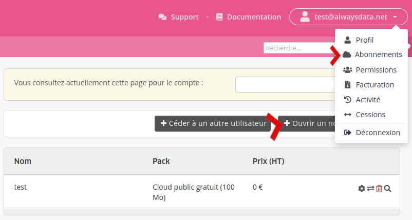
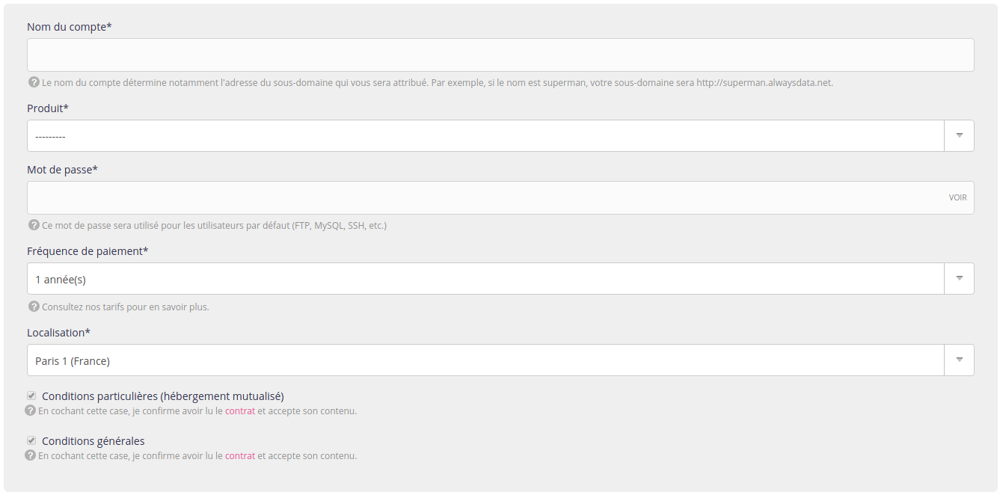

Allez dans le menu **Abonnements** de votre interface client. 

Après avoir cliqué sur **Ouvrir un nouveau compte** vous trouverez un formulaire pour choisir :

- son nom ;
- sa localisation : Cloud Public, Private Cloud ;

si Cloud Public :
- le produit (le pack) ;
- la fréquence de paiement (mensuel ou annuel).

