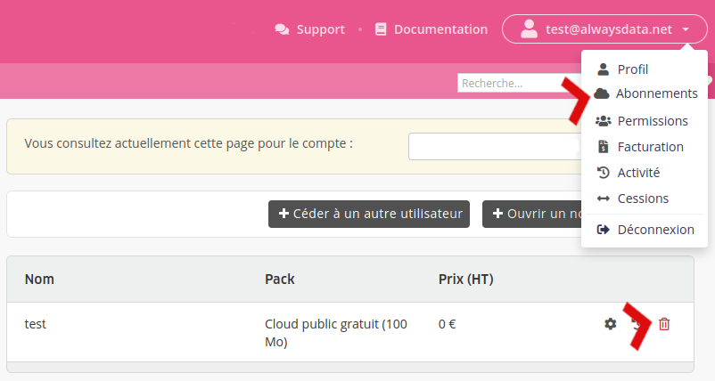

Vous pouvez supprimer un _compte_ (par exemple `mon_projet`) ou votre _profil_ (par exemple `<name@example.org>` propriétaire du compte `mon_projet`).

## Supprimer un compte 

Allez dans le menu **Abonnements** et cliquez sur la _poubelle_ du compte à supprimer.

Cela va supprimer tous les domaines, adresses email, sites web, fichiers, bases de données (...) liés à ce compte.

> [!NOTE]
> Seul le **propriétaire du compte** peut effectuer cette action. Par ailleurs, aucun remboursement n'est prévu lors d'une suppression avant échéance.

- [Comment supprimer son profil](/fr/docs/admin-facturation/comptes/supprimer-un-compte/)
