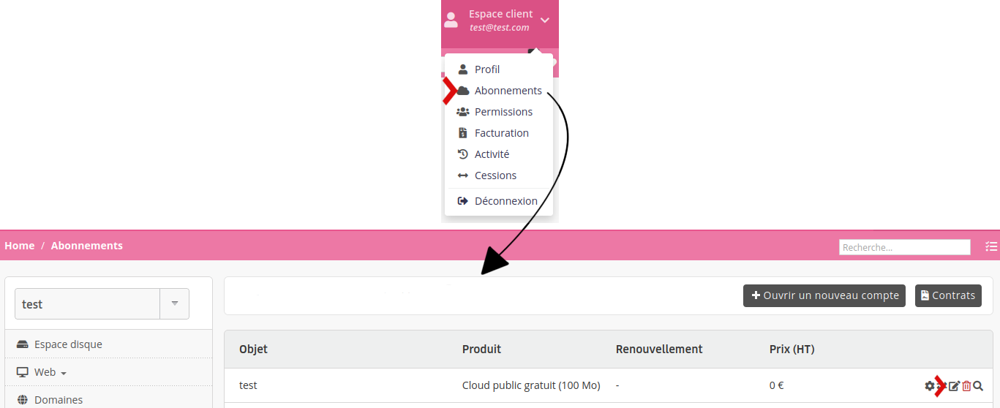
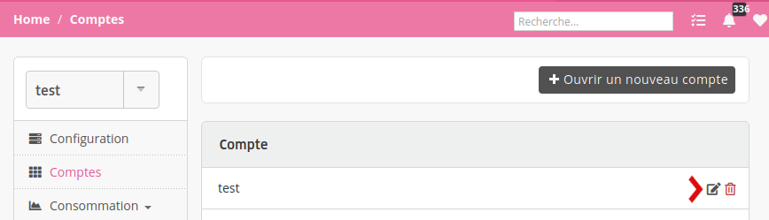
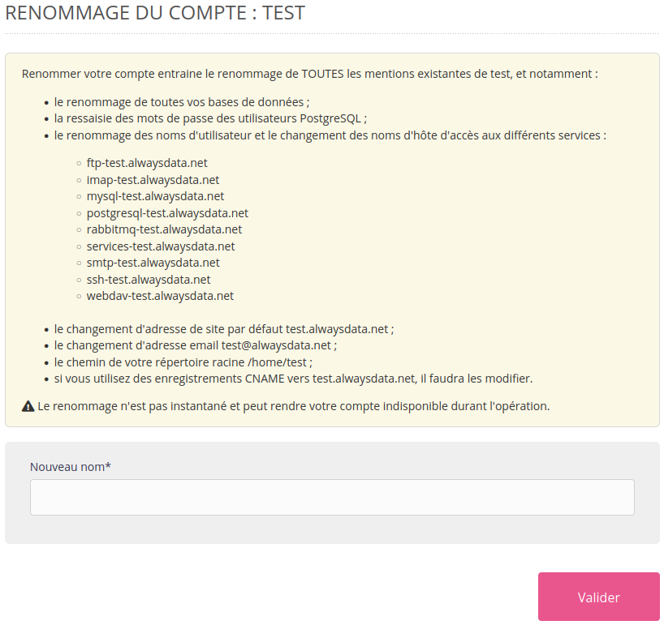

Si le nom d'un compte ne convient plus (changement de dénomination, faute d'orthographe, etc.), il est possible d'en changer.

> [!WARNING] Attention
C'est une fonctionnalité **avancée**. Renommer un compte change de nombreux éléments : les adresses par défaut, les noms d'hôtes aux différents services, les bases de données, les utilisateurs, ou encore le chemin du répertoire racine...

> En conséquence, il faudra *certainement* faire des modifications de configuration dans vos applications et cela peut rendre des services *temporairement indisponibles*.

Rendez-vous :

- dans le menu **Abonnements** de votre **Espace client** pour les comptes sur le *Cloud Public*

- dans le menu **Comptes** du menu du **serveur** pour les comptes sur le *Cloud Privé*

Le nouveau nom de compte sera alors demandé :

> [!NOTE]
> Seul le **propriétaire du compte** peut effectuer cette action.
