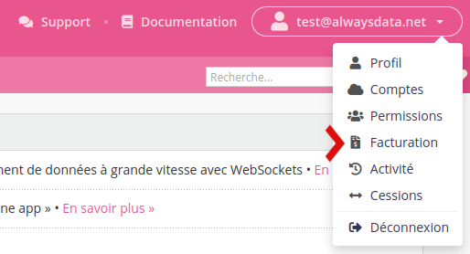

Une facture est émise quelques heures après avoir souscrit à un service d'alwaysdata (hébergement, adresse IP, etc.).

Vous disposez de **30 jours** pour la régler dans **Facturation > Transactions > Alimenter le compte** ou **Facturation > Moyens de paiement > Alimenter le compte** grâce à différents [moyens de paiement](/fr/docs/admin-facturation/facturation/moyens-de-paiement/).

* [Choisir son plan d'hébergement](/fr/docs/admin-facturation/facturation/choisir-son-plan/)
* [Tarifs Cloud Privé](/fr/docs/admin-facturation/facturation/prix-cloud-prive/)
* [Tarifs Cloud Public](/fr/docs/admin-facturation/facturation/prix-cloud-public/)

- [Parrainage](/fr/docs/admin-facturation/facturation/parrainage/)
- [Programmes de réduction](/fr/docs/admin-facturation/programmes/)
- [Chorus Pro](/fr/docs/admin-facturation/facturation/moyens-de-paiement/#chorus-pro)

* [Changer d'offre](/fr/docs/admin-facturation/facturation/changer-doffre/)
* [Tarifs des interventions](/fr/docs/admin-facturation/facturation/interventions-sur-serveurs/)
* [Diverses questions](/fr/docs/admin-facturation/facturation/divers/)

L'ensemble de vos factures et reçus est téléchargeable au format `zip` dans l'onglet **Facturation > Transactions**.

Nos abonnements sont soumis à la reconduction tacite et renouvelés automatiquement.
