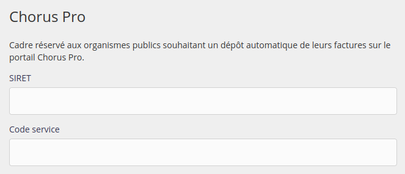
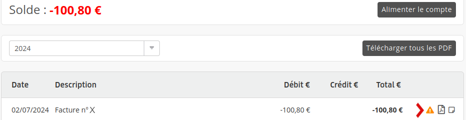

Il existe deux façons différentes de payer vos factures alwaysdata.

## Compte prépayé

À chaque facturation, votre compte prépayé alwaysdata est débité de la somme due. Vous devez créditer ce compte prépayé de manière à couvrir vos débits.

Nous proposons ces différentes méthodes :

- Carte bancaire ;
- PayPal ;
- Virement bancaire : Notre compte bancaire est indiqué sur nos factures. Il faudra préciser dans la description du virement votre _numéro de client_ ou votre _numéro de facture_ dans les commentaires du virement.

> [!NOTE]
> Les alimentations de compte par _virement_ apparaîtront dans votre interface dès qu'elles auront été prises en compte par notre équipe. Cela peut prendre plusieurs jours.

Les paiements par *mandat administratif* sont possibles et reçus comme des virements.

> [!WARNING]
> Nous n'acceptons pas les paiements par *chèque*. Tout chèque reçu sera systématiquement détruit.

### Cartes bancaires acceptées

Les cartes bancaires autorisées par notre prestataire de paiement sont : CB, Visa et MasterCard.

## Prélèvement automatique

Entrez vos coordonnées bancaires - compte ou carte - dans votre administration, menu **Facturation > Moyens de paiement**.

Ce moyen de paiement sera alors prélevé automatiquement de la somme due. Vous n'avez plus à vous soucier de payer votre hébergement alwaysdata.

Lorsque vous activez le prélèvement automatique sur votre compte bancaire, remettez à votre banque, une [autorisation de prélèvement](http://static.alwaysdata.com/docs/Prelevement.png).

## Chorus Pro

Les factures d'hébergement peuvent être mise à disposition sur le portail [Chorus Pro](https://portail.chorus-pro.gouv.fr/).

Pour cela, renseignez dans le menu **Facturation > Moyens de paiement > Paramètres** votre SIRET et le code de service (si votre administration en utilise un).

Les factures seront alors automatiquement envoyées sur le portail Chorus Pro à leur émission.

Si votre administration requiert l'ajout d'un numéro d'engagement celui-ci sera demandé dans un deuxième temps au niveau de la facture.

