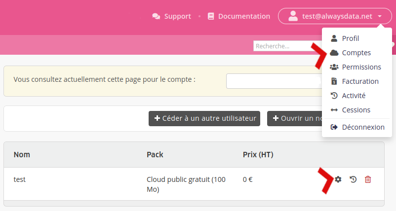

Pour changer d'offre, rendez-vous dans **Abonnements > Modifier - ⚙️ le compte concerné** :

Vous pouvez changer de _[pack](/fr/docs/admin-facturation/facturation/prix-cloud-public/)_ et de _période d'engagement_. La facture pour le nouvel abonnement est éditée le lendemain et vous aurez alors 30 jours pour la payer.

Dans les cas suivant, il faudra contacter le [support](https://admin.alwaysdata.com/support/add/) :

- prendre un [Cloud Privé](/fr/docs/admin-facturation/facturation/prix-cloud-prive/) (ou en changer sa configuration / la période d'engagement) ;
- déplacer des comptes sur un Cloud Privé (et inversement) : les comptes sont des "boîtes noires" que l'équipe support peut facilement déplacer d'un serveur à un autre sans toucher son contenu ;
- changer de période d'engagement d'un abonnement IP.

## Remboursement au prorata

Un remboursement au prorata est automatiquement effectué sur le _compte prépayé_ :

- lors du passage à une offre supérieure ou inférieure ;
- lors de la migration de comptes vers des Cloud Privés.

Ce remboursement pourra servir à payer les prochaines factures.

> [!NOTE]
> Aucun remboursement n'est effectué lors du passage vers le pack gratuit - contactez le [support](https://admin.alwaysdata.com/support/add/) pour qu'il analyse votre situation.
