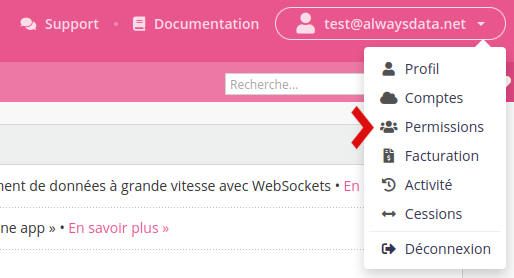

Parce que l'hébergement de vos données implique très souvent différents acteurs, notre interface d'administration vous permet d'octroyer des permissions sur différents niveaux de granularité.

Vous pouvez paramétrer les permissions via le menu **Permissions** de votre espace client.

## Permissions globales

- __Gestion des comptes__ : délègue l'ouverture de comptes à vos associés (menu *Abonnements*)  ;
- __[Facturation](/fr/docs/admin-facturation/facturation/)__ : permet aux services comptables ou administratifs de recevoir une alerte lorsque le solde de votre compte est négatif ou lors de l'ouverture d'un ticket concernant la facturation par nos services et de payer les factures, acheter/renouveler/transférer les domaines (menu *Facturation*) ;
- __Technique au niveau des comptes__ : permet aux équipes techniques de gérer l'aspect purement technique de votre hébergement (sites, emails, bases de données..) sans se soucier de sa gestion et facturation ;
- __Technique au niveau des serveurs__ : disponible sur [Cloud Privé](/fr/docs/admin-facturation/facturation/prix-cloud-prive/), votre administrateur réseau pourra gérer règles de firewall, queue d'envoi des emails et bien d'autres...

## Permissions techniques

Que ce soit pour l'aspect purement technique de vos comptes ou de vos serveurs, votre organisation impose un découpage des responsabilités techniques en interne entre plusieurs personnes ou groupes de personnes ou entre sous-traitants externes qui ont besoin d'accès même restreints. Vous pouvez donc définir des permissions par **service** et par **compte** ou **serveur**.

### Par compte

À partir du moment où un profil a des permissions sur le compte, il a accès au menu *Statut des serveurs*.

- __Contact technique__ : soyez alerté lors de l'ouverture d'un ticket technique par nos services concernant le compte ;
- __Consommation__ : suivez la consommation d'espace disque (menus *Espace disque*, *Avancé > Logs*) ;
- __Ressources__ : permission pour les comptes sur [Cloud privé](/fr/docs/admin-facturation/facturation/prix-cloud-prive/) permet de gérer les [sondes](/fr/docs/hebergement-web/sites/utiliser-les-sondes-de-monitoring/) (menu *Web > Sondes*) et [ressources](/fr/docs/caracteristiques-techniques/ressources-systemes-alertes-et-limitations/) (menu *Avancé > Ressources*) ;
- __[Statistiques](/fr/docs/hebergement-web/statistiques/)__ : analysez les visites de vos sites (menu *Web > Analytics*)  ;
- __[Sites](/fr/docs/hebergement-web/sites/)__ : configurez les sites web et l'environnement Apache (menus *Web > Sites*, *Web > Configuration*) ;
- __[Domaines](/fr/docs/domaines/)__ gérez techniquement les domaines et leurs DNS (menu *Domaines*). Pour toutes les opérations facturables, il faudra aussi les permissions __Facturation__ sur le profil propriétaire ;
- __[Emails](/fr/docs/emails/)__ (menus *Emails > Adresses*, *Emails > Listes de diffusion*, *Emails > Configuration*) ;
- __[Historique des emails envoyés](/fr/docs/emails/verifier-l-envoi-d-un-email/)__ (menu *Emails > Historique*) ;
- __[Bases de données](/fr/docs/hebergement-web/bases-de-donnees/)__ (menu *Bases de données*) ;
- __[FTP](/fr/docs/hebergement-web/acces-distant/ftp/)__ (menu *Accès distant > FTP*) ;
- __[SSH](/fr/docs/hebergement-web/acces-distant/ssh/)__ (menu *Accès distant > SSH*) ;
- __[WebDAV](/fr/docs/hebergement-web/acces-distant/webdav/)__ (menu *Accès distant > WebDAV*) ;
- __[Environnement](/fr/docs/hebergement-web/langages/)__ : configurez les langages de programmation (menu *Environnement*) ;
- __Processus__ : processus en cours d'exécution pouvant être analysés ou tués (menu *Avancé > Processus*) ;
- __[Adresses IP](/fr/docs/hebergement-web/adresses-ip-dediees/)__ : louer des IP dédiées pour HTTP ou SMTP (menu *Avancé > Adresses IP*) ;
- __[Certificats SSL](/fr/docs/hebergement-web/sites/ssl-tls)__ (menu *Avancé > Certificats SSL*) ;
- __[Migration](/fr/docs/caracteristiques-techniques/migrations/)__ (menu *Avancé > Migrations*) ;
- __[Tâches planifiées](/fr/docs/hebergement-web/taches-planifiees/)__ (menu *Avancé > Tâches planifiées*) ;
- __[Sauvegardes](/fr/docs/hebergement-web/sauvegardes/)__ (menu *Avancé > Restauration de sauvegardes*) ;
- __[Services](/fr/docs/hebergement-web/services/)__ (menu *Avancé > Services*).

### Par serveur

À partir du moment où un profil a des permissions sur le serveur, il a accès au menu *Configuration*.

- __Contact technique__ : soyez alerté lors de l'ouverture d'un ticket technique par nos services concernant un serveur ;
- __[Utilisateurs SSH](/fr/docs/hebergement-web/acces-distant/ssh/cles-ssh-globales/)__ : installez des clés SSH pour un accès simplifié aux différents comptes (menu *Clés SSH*);
- __[Règles firewall](/fr/docs/caracteristiques-techniques/configurer-le-firewall/)__ : créez des règles firewall et consultez le bannissement automatique d'IP au niveau du serveur  (menu *Firewall*);
- __Configuration SMTP__ : gérez la queue d'envoi d'emails, le relais SMTP et le score de spam (menu *SMTP*);
- __Utilisateurs base de données__ : donnez un accès global aux bases de données de l'ensemble des comptes (menu *Utilisateurs MySQL*) ;
- __Configuration SSL__ : choisissez le certificat SSL à retourner sur le serveur (`*.alwaysdata.net` par défaut) et la [configuration TLS](/fr/docs/hebergement-web/sites/ssl-tls/configurer-tls/) du serveur (menu *SSL*) ;
- __Configuration HTTP__ : choisissez un site web qui sera la [page d'accueil par défaut](/fr/docs/hebergement-web/sites/divers/#site-http-par-defaut) et la [période de rétention des logs](/fr/docs/hebergement-web/acces-distant/repertoire-admin/#logs) (menu *HTTP*) ;
- __Consommation__ : accédez à un ensemble d'information sur votre serveur (menus Comptes, Statut du serveur). Pour ouvrir des comptes sur le serveur il sera nécessaire d'avoir la permission __Gestion des comptes__ sur le profil propriétaire ;
- __[Ressources](/fr/docs/caracteristiques-techniques/ressources-systemes-alertes-et-limitations/)__ : modifiez les limitations de ressources par compte - RAM, CPU, espace disque (menu *Ressources*).
- __[Migration](/fr/docs/caracteristiques-techniques/migrations/)__ (menu *Migrations*) ;

## 2FA nécessaire

Lorsque la case **2FA nécessaire** est cochée, l'utilisateur en question doit se connecter [avec 2 facteurs](/fr/docs/admin-facturation/profil/authentification-2-facteurs/) pour accéder aux menus auxquels on lui a donné accès.

## Mes permissions

Il est possible de supprimer les permissions que nous avons sur d'autres profils via le menu **Permissions > Mes permissions**. La suppression ne s'effectue pas finement, elles le seront toutes.

## Divers

En créant des permissions à une adresse email n'ayant pas de profil alwaysdata, cette personne recevra un email pour initialiser son profil.
