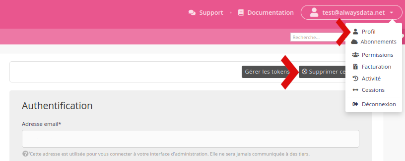

Vous pouvez supprimer un _compte_ (par exemple `mon_projet`) ou votre _profil_ (par exemple `<name@example.org>` propriétaire du compte `mon_projet`).

Pour supprimer ce second, allez dans le menu **Profil** et cliquez sur _Supprimer ce profil_.

Cela va supprimer tous les comptes et serveurs attachés, ainsi que votre historique.

> [!WARNING] Attention
> Une fois cette opération effectuée, il ne sera en aucun cas possible de revenir en arrière.

- [Comment supprimer un compte](/fr/docs/admin-facturation/comptes/supprimer-un-compte/)
