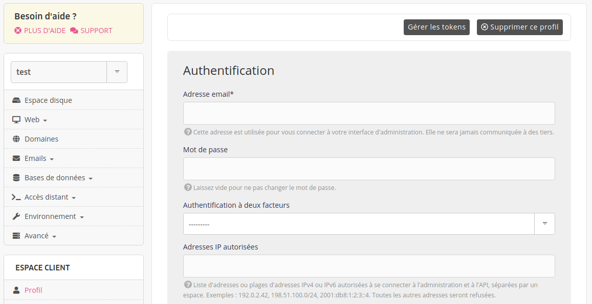

Pour permettre l'accès à l'interface d'administration alwaysdata à seulement certaines IP, rendez-vous dans **Profil**.

L'accès sera bloqué à toute autre connexion venant d'IP non renseignée.

> [!NOTE]
> Si vous vous êtes trompé - ou avez changé - d'IP d'accès envoyez un email à *contact[at]alwaysdata.com* pour la désactiver. [Une vérification sera effectuée](/fr/docs/admin-facturation/profil/admin-access-loss#blocage-lié-à-la-limitation-diphahahugoshortcode-s1-hbhb).
