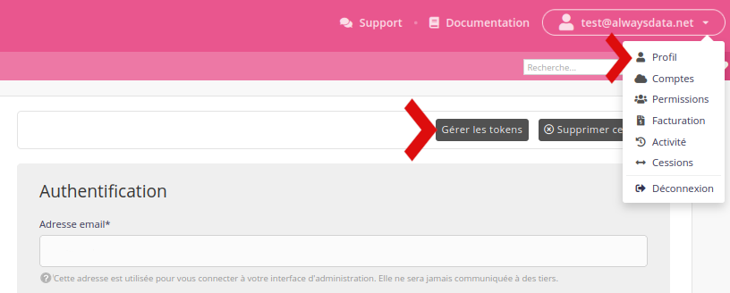

Les tokens sont des identifiants utilisés pour authentifier un utilisateur ou un programme appelant notre [API](/fr/docs/developpement/api). 

Pour en générer rendez-vous dans le menu **Profil**.

Il est nécessaire d'avoir activé l'[authentification 2 facteurs](/fr/docs/admin-facturation/profil/authentification-2-facteurs/) pour générer/modifier ses tokens.

> [!TIP] Astuce
> Pour encore plus de sécurité, générez en un par application.

Comme pour l'interface d'administration vous pouvez ne donner accès qu'à [certaines IP](/fr/docs/admin-facturation/profil/autorisation-dacces-selon-IP).

Ils ont les mêmes [permissions](/fr/docs/admin-facturation/permissions/) que le profil auquel ils sont liés.
