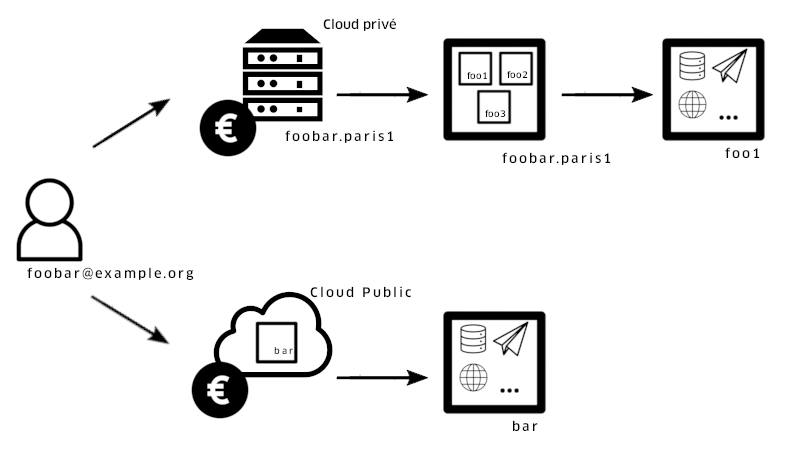
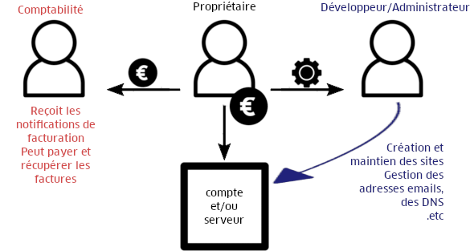
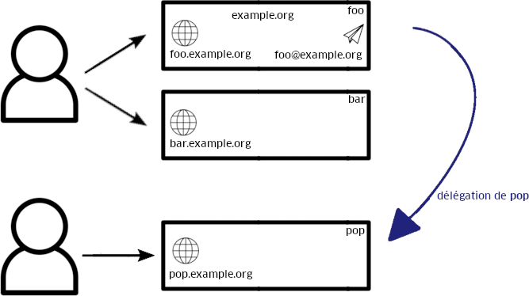

Un utilisateur alwaysdata, nommé **profil** est représenté par une adresse email qui est utilisé pour se connecter à l'[interface d'administration](https://admin.alwaysdata.com).

Celui-ci *peut* être propriétaire de **comptes** sur notre [Cloud Public](/fr/docs/admin-facturation/facturation/prix-cloud-public/) ainsi que des **[serveurs](/fr/docs/admin-facturation/facturation/prix-cloud-prive/)** sur lequel il peut y créer des comptes. Chaque **compte** est *isolé* les uns des autres.

Sur ces **comptes**, il est possible de gérer des [domaines](/fr/docs/domaines/), d'héberger des [adresses emails](/fr/docs/emails/), des [sites web](/fr/docs/hebergement-web/sites/), des [bases de données](/fr/docs/hebergement-web/bases-de-donnees/) ou encore d'autres applications.

Il peut aussi avoir des **[permissions](/fr/docs/admin-facturation/permissions)** sur d'autres profils alwaysdata.

Les adresses emails hébergées sont liées à des domaines. Elles sont *toujours* sur le même compte que le domaine.

Les [adresses des sites](/fr/docs/hebergement-web/sites/ajouter-un-site/#adresses) *peuvent* aussi être liées à des domaines. Si c'est le cas elles peuvent être :
- sur le même compte ;
- sur un autre compte du même profil alwaysdata ;
- [déléguées](/fr/docs/domaines/deleguer-un-sous-domaine/) à un compte d'un autre profil alwaysdata.

> Icônes : The Noun Project
