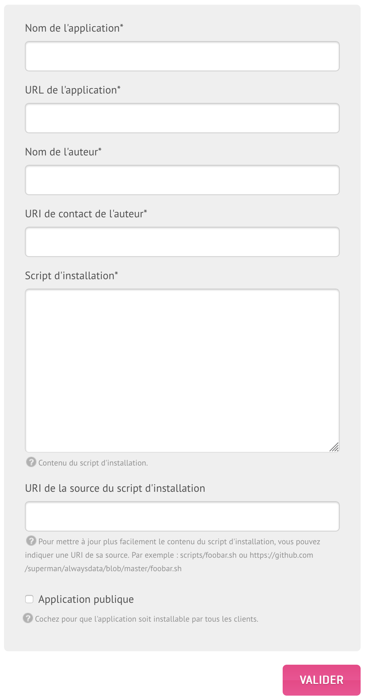

Tout utilisateur peut proposer un script dans le *langage de son choix* qui permettra aux utilisateurs d’installer son application. Ce script sera exécuté avec les *droits du compte sur lequel l’installation a lieu* et doit débuter par un commentaire au format YAML.



Les scripts se composent de deux parties :

* le **dataset** au format YAML, permettant de configurer le site et demander à l'utilisateur les informations nécessaires au script (les variables `FORM_*`). On peut le diviser en quatre :
    * **site** : voir la [documentation API](https://api.alwaysdata.com/v1/site/doc/) qui reprend toutes les options possibles.
    * **database** : mysql, postgresql, couchdb, rabbitmq.
    * **requirements**: spécifier les conditions bloquantes pouvant être problématiques sur certains plan d'hébergement/packs.
    * **form** : toutes les variables demandées à l'utilisateur créant le site. Exemple : titre du site, identifiant administrateur, adresse email, nom/prénom de l’administrateur...
* le **script** en lui-même


## Variables d’environnement

| Variables             | Description                                                                                           | Exemple                                 |
|-----------------------|-------------------------------------------------------------------------------------------------------|-----------------------------------------|
| USER                  | Nom du compte                                                                                         | `foo`                                   |
| HOME                  | Racine du compte pour le script                                                                       | `/home/foo/exemple/`                    |
| APPLICATION_NAME      | Nom de l’application                                                                                  |                                         |
| INSTALL_URL           | Adresse du site                                                                                       | `foo.exemple.net/test`                  |
| INSTALL_URL_PATH      | Racine du site (base URL)                                                                             | `/test`                                 |
| INSTALL_URL_HOSTNAME  | Nom d’hôte du site                                                                                    | `foo.exemple.net`                       |
| INSTALL_PATH_RELATIVE | Chemin relatif depuis la racine du compte (sans slash final)                                          | `exemple`                               |
| INSTALL_PATH          | Chemin absolu (sans slash final)                                                                      | `/home/foo/exemple`                     |
| DATABASE_USERNAME     | Utilisateur de connexion à la base de données (automatiquement généré)                                | `foo_*`                                 |
| DATABASE_PASSWORD     | Mot de passe de l’utilisateur de connexion à la base de données (automatiquement généré)              |                                         |
| DATABASE_NAME         | Base de données du site (automatiquement générée)                                                     | `foo_*`                                 |
| DATABASE_HOST         | Nom d’hôte de connexion au serveur de base de données                                                 | `mysql-foo.alwaysdata.net` (base MySQL) |
| SMTP_HOST             | Nom d’hôte de connexion au serveur d’envoi de mails                                                   | `smtp-foo.alwaysdata.net`               |
| RESELLER_DOMAIN       | Domaine-racine utilisé par l'hébergeur                                                                | `alwaysdata.net`                        |
| FORM_*                | Autres variables explicitement demandées à l'utilisateur dans la section "form" du dataset YAML       |                                         |
| PORT                  | Port spécifique pour les sites de type Programme utilisateur, Node.js, Elixir, .NET et Deno                |                                         |
| `::` ou IP         | IP spécifique pour les sites de type Programme utilisateur, Node.js, Elixir, .NET et Deno (préférer `::` à IP) |                                         |

Si d’autres variables sont nécessaires, ouvrez un [ticket de support](https://admin.alwaysdata.com/support/add/).


### Notes et astuces

* Le script doit commencer par `set -e` pour le stopper lorsqu’il échoue ;
* Indiquer la **version du langage utilisée** (PHP, Python, Ruby, Node.js et Elixir) est préconisé pour éviter de dépendre de la configuration par défaut du compte ;
* Le répertoire racine indiqué par l'utilisateur (`INSTALL_PATH`) sert de racine pour le script (un `export HOME=` est exécuté par défaut) ;
* Pour rendre un script d'installation publique il faut indiquer la condition `disk` des `requirements` ;
* Il est préférable de demander un nombre minimal d’informations pour éviter de rendre le script exhaustif. _Les utilisateurs pourront modifier la configuration de leur application ultérieurement._
* Pour ajouter un champ de formulaire **optionnel**, il faut mettre l'option `required` à `false`. Si l'utilisateur n'indique rien le champ restera vide ;
* Les *labels* et *regex_text* sont traductibles. En fonction de la langue choisie sur son interface d'administration alwaysdata, l'utilisateur peut avoir les questions du formulaire dans les langues précisées.

> [!NOTE]
> Pour rendre son script accessible aux utilisateurs de la plateforme d’alwaysdata, il est nécessaire de cocher la case pour le rendre _public_. 
> **Tout script marqué comme public doit être maintenu et sera à minima vérifié par l’équipe d’alwaysdata.**


> [!TIP] Astuce
> Une _URL d’un dépôt_ peut être indiquée pour faciliter la maintenance. Dans ce cas, une fois les modifications poussées sur le dépôt il ne reste qu’à mettre à jour l’application via le bouton prévu à cet effet.


## Exemples

1. Script d’installation d'Odoo

```
#!/bin/bash

# Declare site in YAML, as documented on the documentation: https://help.alwaysdata.com/en/marketplace/build-application-script/
# site:
#     type: user_program
#     working_directory: '{INSTALL_PATH_RELATIVE}'
#     command: '.venv/bin/python odoo-bin --config=.odoorc --http-port=$PORT'
# database:
#     type: postgresql
# requirements:
#     disk: 1400

set -e

# https://www.odoo.com/documentation/19.0/administration/install/source.html
# https://www.odoo.com/documentation/19.0/administration/on_premise/deploy.html#builtin-server
# https://www.odoo.com/documentation/19.0/developer/reference/cli.html

export PYTHON_VERSION=3.13
export NODEJS_VERSION=24

git clone -b 19.0 --depth 1 https://github.com/odoo/odoo.git .

npm install -g rtlcss

# Create virtualenv & install dependancies in it
python -m venv .venv
source .venv/bin/activate

pip install --upgrade pip
pip install -r requirements.txt

mkdir -p odoo-data

# Configuration
cat << EOF > .odoorc
[options]
db_name = $DATABASE_NAME
db_user = $DATABASE_USERNAME
db_password = $DATABASE_PASSWORD
db_host = $DATABASE_HOST
addons_path = $INSTALL_PATH/addons
data_dir = $INSTALL_PATH/odoo-data
email_from = $USER@$RESELLER_DOMAIN
http_interface = ::
EOF

# Install
python odoo-bin --config=.odoorc --init --no-http --stop-after-init

# Default credentials for first login: admin / admin
```

La condition `disk:1400` précise que l'installation d'Odoo nécessite 1400 Mo d'espace disque. L'offre gratuite (Free) est donc trop juste.

2. Script d’installation de Backdrop

```
#!/bin/bash

# Declare site in YAML, as documented on the documentation: https://help.alwaysdata.com/en/marketplace/build-application-script/
# site:
#     type: php
#     path: '{INSTALL_PATH_RELATIVE}'
#     php_version: '8.5'
# database:
#     type: mysql
# requirements:
#     disk: 60
# form:
#     language:
#         type: choices
#         label:
#             en: Language
#             fr: Langue
#         choices:
#             de: Deutsch
#             en: English
#             es: Español
#             fr: Français
#             it: Italiano
#     site_name:
#         label:
#             en: Site name
#             fr: Nom du site
#         max_length: 255
#     email:
#         type: email
#         label:
#             en: Email
#             fr: Email
#         max_length: 255
#     admin_username:
#         label:
#             en: Administrator username
#             fr: Nom d'utilisateur de l'administrateur
#         regex: ^[ a-zA-Z0-9.+_-]+$
#         regex_text:
#             en: "It can include uppercase, lowercase, numbers, spaces, and special characters: .+_-."
#             fr: "Il peut comporter des majuscules, des minuscules, des chiffres, des espaces et les caractères spéciaux : .+_-."
#         max_length: 255
#     admin_password:
#         type: password
#         label:
#             en: Administrator password
#             fr: Mot de passe de l'administrateur
#         min_length: 5
#         max_length: 255

set -e

# https://docs.backdropcms.org/documentation/system-requirements
# https://github.com/backdrop-contrib/bee/wiki/Usage

wget --no-hsts https://github.com/backdrop-contrib/bee/releases/download/1.x-1.1.0/bee.phar
php bee.phar download-core
php bee.phar install --db-name=$DATABASE_NAME --db-user=$DATABASE_USERNAME --db-pass=$DATABASE_PASSWORD --db-host=$DATABASE_HOST --username=$FORM_ADMIN_USERNAME --password=$FORM_ADMIN_PASSWORD --email=$FORM_EMAIL --site-mail=$USER@$RESELLER_DOMAIN --langcode=$FORM_LANGUAGE --site-name=$FORM_SITE_NAME --auto
```

Utilisez la condition `regex_text` pour expliquer les `regex` avec des mots.
