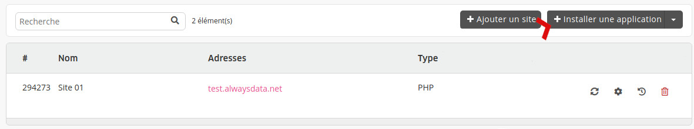

Déployez facilement et rapidement des applications ou frameworks dans votre espace utilisateur.

Les applications sont mises en place avec une configuration sécurisée standard. Libre à vous de modifier, mettre à jour, ou personnaliser votre installation par la suite.

Le système créé leurs répertoires durant l'installation.

- [Changer l'adresse d'un site web](/web-hosting/sites/change-a-website-address)

> [!TIP]
> Si notre marketplace ne propose pas ce que vous cherchez, installez-le à la main et automatisez son déploiement en créant un [script d'installation applicatif](/fr/docs/developpement/marketplace/creer-script-dapplication/).

## Guides

- [Drupal](/fr/docs/developpement/marketplace/drupal)
- [Joomla](/fr/docs/developpement/marketplace/joomla)
- [Odoo](/fr/docs/developpement/marketplace/odoo)
- [PrestaShop](/fr/docs/developpement/marketplace/prestashop)
- [WordPress](/fr/docs/developpement/marketplace/wordpress)
