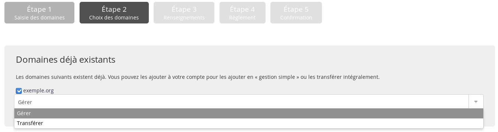
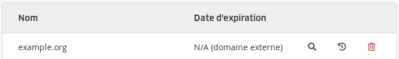

Opération gratuite, elle permet de transférer la gestion _technique_ du domaine sans toucher à la gestion _administrative_ (son registrar). Si vous souhaitez passer toute la gestion chez alwaysdata, passez par un [transfert de domaine](/fr/docs/domaines/transferer-un-domaine/).

Nous voulons ici ajouter le domaine et **changer de serveurs DNS** chez le registrar pour mettre `dns1.alwaysdata.com` et `dns2.alwaysdata.com`.

1. Dans votre interface d'administration, allez dans **Domaines > Ajouter un domaine** ;
   
2. Renseignez les noms de domaines que vous souhaitez ajouter ;
   
   > [!NOTE]
   > Saisissez uniquement le domaine, sans le sous-domaine. Par exemple : example.org et non www.exemple\.org.
   
3. Choisissez de le **gérer**.
   

Cela va ajouter le domaine en tant que _domaine externe_ dans la liste.

Vous pourrez alors créer des [adresses email](/e-mails/create-an-e-mail-address), des [sites web](/web-hosting/sites/add-a-site) et gérer les [enregistrements DNS](/fr/docs/domaines/ajouter-un-enregistrement-dns/).

> [!WARNING] Attention
> Si certains enregistrements DNS doivent être gardés - par exemple ne pas changer de prestataire emails - il faudra préparer la [zone DNS](/fr/docs/domaines/ajouter-un-enregistrement-dns/) avant d'effectuer le changement de serveurs DNS.
