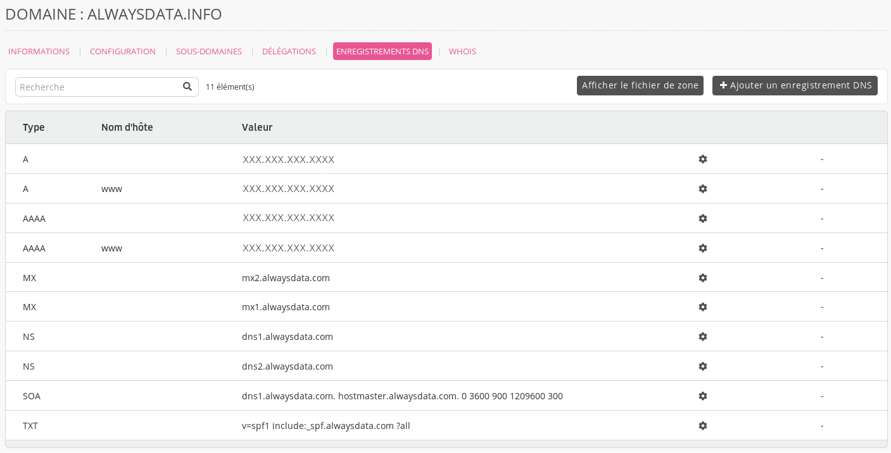
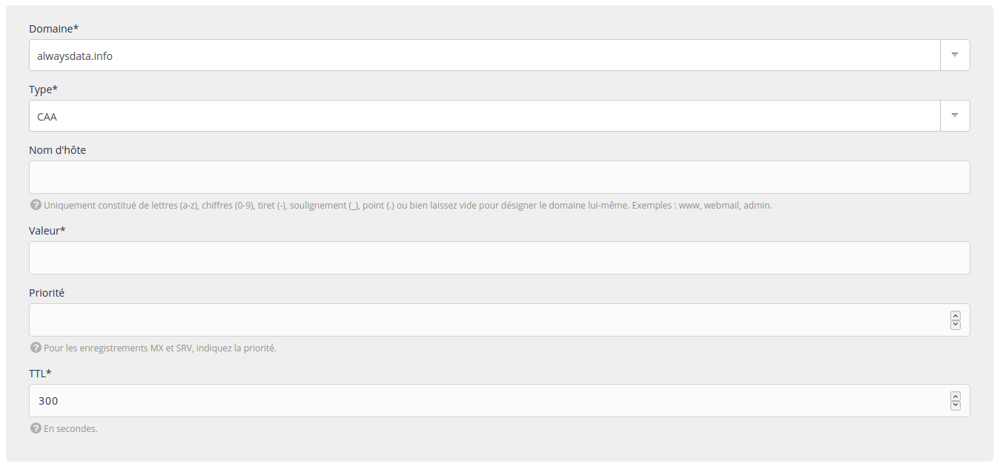

Un [enregistrement CAA](https://fr.wikipedia.org/wiki/DNS_Certification_Authority_Authorization) liste les autorités de certifications homologuées à émettre des certificats pour un domaine. Toute autorité de certification ne faisant pas partie des émetteurs autorisés par l'enregitrement CAA d'un domaine, ne sera pas autorisée à émettre de certificat pour ce domaine ou tout sous-domaine.

1.   Rendez-vous sur **Domaines > Details de [example.org] - 🔎 > Enregistrements DNS** ;
    

2.   Choisissez **Ajouter un enregistrement DNS** ;

3.   Renseignez le formulaire.
    

> [!WARNING] Attention
> Ne mettez pas la racine dans **Nom d'hôte**.
> Par exemple, en indiquant `www.example.org` dans cette case, vous créerez un enregistrement pour `www.example.org.example.org`.


Trois étiquettes sont définies :
- `issue` qui autorise une autorité ;
- `issuewild` qui autorise une autorité pour les certificats wildcard ;
- `iodef` qui signale une URL que peut contacter les autorités de certifications en cas de problèmes.

> [!NOTE]
> Des [certificats Let's Encrypt](/fr/docs/hebergement-web/sites/ssl-tls/certificats-lets-encrypt/) sont générés pour toute adresse HTTP hébergée sur nos serveurs. Ils doivent donc faire partie des autorités validées.


## Quelques exemples

-  Autorisation de Let's Encrypt :

    ```
    » Nom d'hôte : [laisser vide]
    » Valeur : 0 issue "letsencrypt.org"
    » TTL : 300
    ```

----
* [RFC 6844](https://tools.ietf.org/html/rfc6844)
