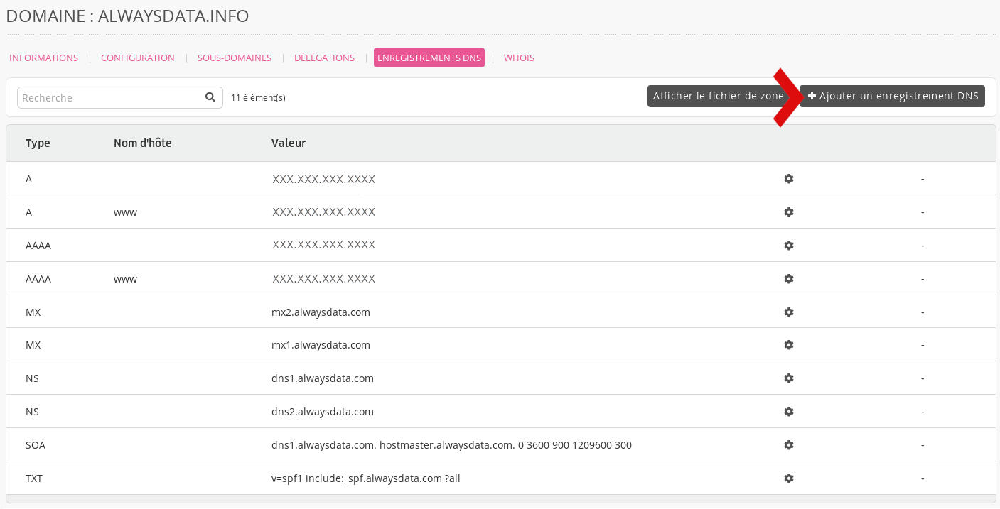
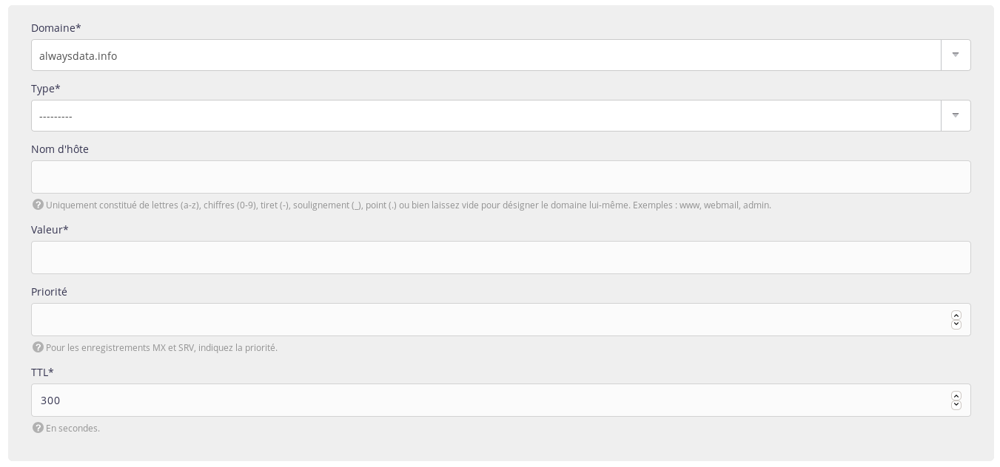
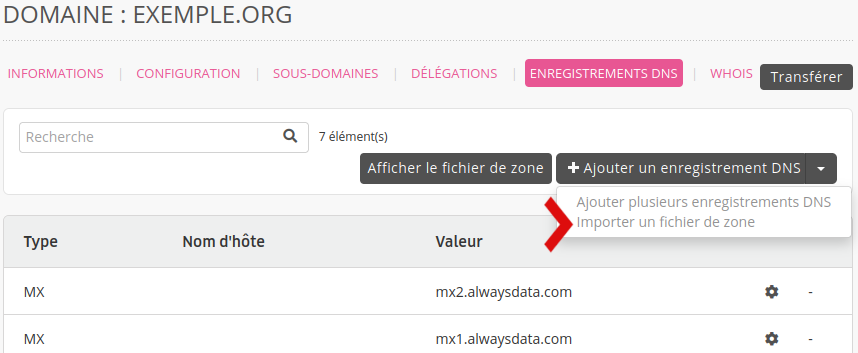

1.   Allez dans **Domaines > Details de [example.org] -  ⚙️ > Enregistrements DNS** ;
    

2.  Choisissez **Ajouter un enregistrement DNS** ;

3.  Renseignez le formulaire.
    

> [!WARNING] Attention
> Ne mettez pas la racine dans **Nom d'hôte**. Par exemple, en indiquant `www.example.org` dans cette case, vous créerez un enregistrement pour `www.example.org.example.org`.

> [!NOTE]
> Un enregistrement ayant `@` comme nom d'hôte pour certains prestataires correspond au sous-domaine vide. Dans notre cas, la case **Nom d'hôte** devra être vide.

- [Ajouter un enregistrement SRV](/fr/docs/domaines/ajouter-un-enregistrement-srv/)
- [Ajouter un enregistrement CAA](/fr/docs/domaines/ajouter-un-enregistrement-caa/)
- [Utiliser des MX externes](/fr/docs/domaines/utiliser-des-mx-externes/)

## Importer un fichier de zone

Un fichier de zone DNS est un fichier texte qui contient les détails de tous les enregistrements DNS contenus. Il suit un format standard, ce qui permet le transfert simple des enregistrements DNS d'un prestataire à un autre.

Cela supprimera les enregistrements DNS précédemment ajoutés.

## Ressources

- [Liste des types d'enregistrements DNS](https://fr.wikipedia.org/wiki/Liste_des_enregistrements_DNS)
- [Ajouter des enregistrements DNS avec CSV](/fr/docs/domaines/creer-des-enregistrements-DNS-via-csv/)
