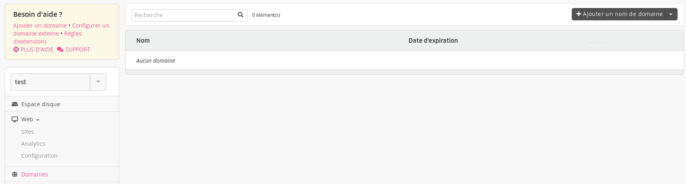
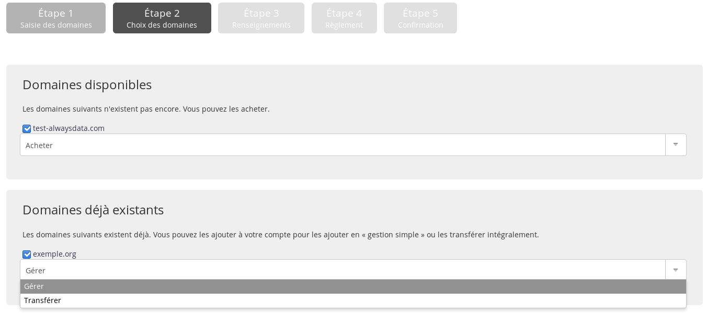
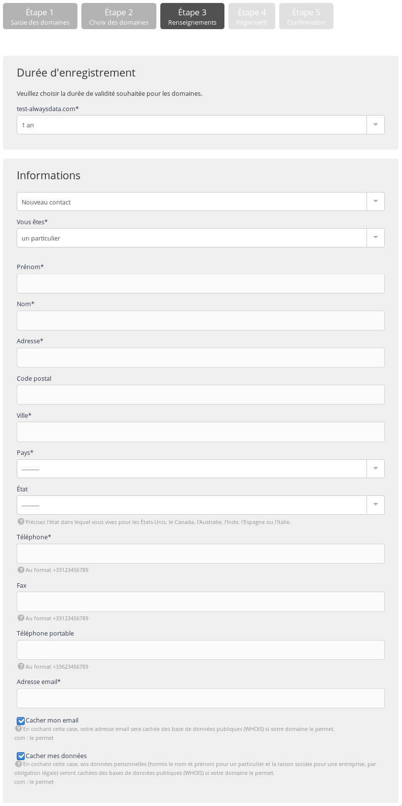

1. Dans votre interface d'administration, allez dans **Domaines > Ajouter un domaine** ;

2. Renseignez les noms de domaines que vous souhaitez acheter ;

> [!NOTE]
> Saisissez uniquement le domaine, sans le sous-domaine. Par exemple : example.org et non www.exemple\.org.

3. Choisissez de l'_enregistrer_. **Acheter** peut ne pas être proposé : quand le domaine existe déjà, si alwaysdata ne gère pas l'extension, si le domaine est déjà renseigné sur un autre compte alwaysdata...

4. Choisissez la _durée d'existence_ du domaine. Il pourra être renouvelé par la suite ;
5. Et entrez les informations du contact propriétaire. Ces informations dépendent de l'extension prise.

> [!NOTE]
> Le domaine sera créé quelques minutes après le paiement.

- [Prix](https://www.alwaysdata.com/fr/domaines/#main)

## Quelle extension de domaine dois-je choisir ?
Beaucoup d’extensions existent, certaines sont géographiques et rattachées à un pays ou une zone institutionnelle, d’autres sont génériques. L’extension à choisir, dépend de votre besoin, de votre budget mais aussi de la nationalité du propriétaire.
