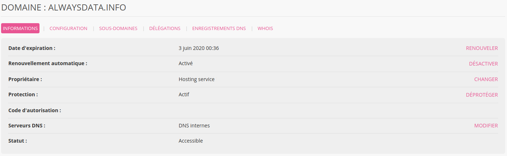
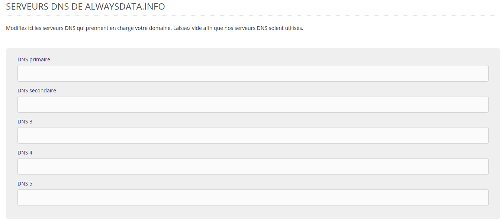

Les [serveurs DNS](https://fr.wikipedia.org/wiki/Domain_Name_System) définissent quels serveurs contacter pour chaque service. Ils sont donc définis chez le registrar - le prestataire de la gestion administrative du domaine.

1. Demandez à votre nouveau prestataire ses serveurs DNS ;
2. Dans votre interface d'administration, allez dans **Domaines > Détails** du domaine concerné **> Modifier** ses serveurs DNS ;
   
3. Indiquez les adresses de vos nouveaux serveurs DNS.
   

> [!NOTE]
> Lorsque les champs des serveurs DNS sont vides, le domaine utilise les serveurs DNS d'alwaysdata.
